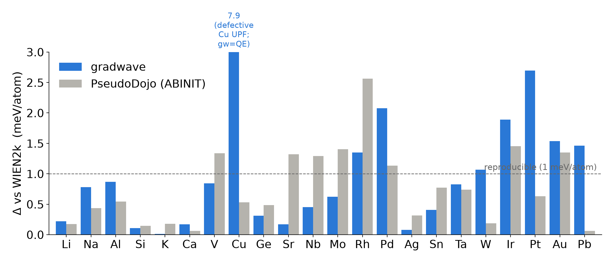
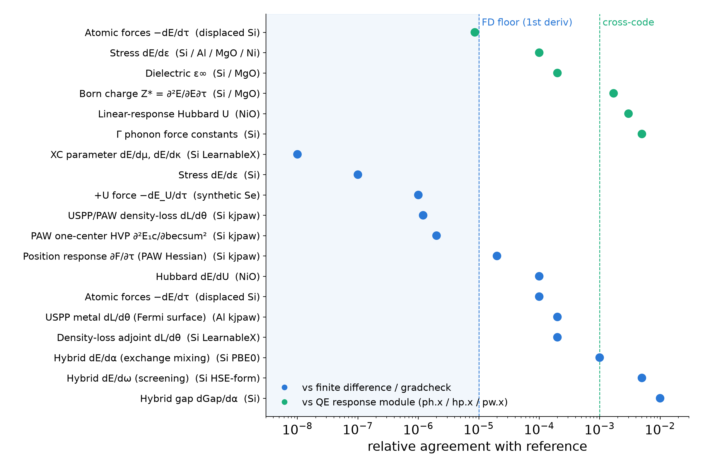
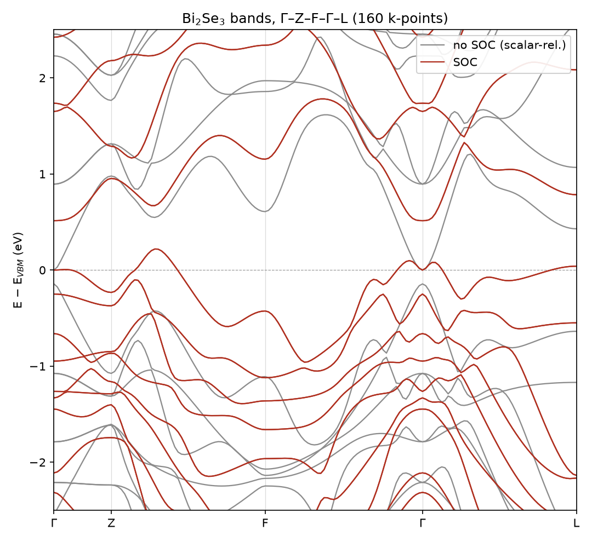

<div align="center">

# gradwave

**Differentiable plane-wave density functional theory for periodic solids, in PyTorch.**

[](https://github.com/wladerer/gradwave/actions/workflows/ci.yml)


</div>

gradwave solves the Kohn-Sham equations in a plane-wave basis with norm-conserving or
ultrasoft/PAW pseudopotentials. Every energy term is a pure tensor function of the
atomic positions, the cell, the density, and the functional's parameters, so automatic
differentiation gives the derivative-based properties (forces, stress, and phonons)
straight from the total energy. An implicit-differentiation wrapper gives the response
of the self-consistent density to any parameter of the functional. The same machinery
trains parameters against data, so an exchange-correlation functional, a hybrid's
mixing and screening, or a Hubbard U each descend by gradient through the SCF. Base
units are eV and Ångström, and every tensor is float64 or complex128, on CPU and GPU.

<div align="center">

</div>

*A GGA exchange functional trained by gradient descent through the self-consistent
density. Each gradient is one adjoint solve rather than a finite difference over
re-converged calculations. From perturbed parameters, κ and μ descend to their PBE
values while the four-system density loss falls three orders of magnitude
(`examples/train_xc_paw.py`).*

## Features

gradwave runs the calculations a plane-wave practitioner expects, and the input schema
is the same across the norm-conserving and PAW paths (the formalism is detected from
the UPF file).

- **Functionals.** LDA, PBE, and the r2SCAN meta-GGA (`xc: r2scan`), transcribed from
  libxc and matched pointwise. Global (PBE0-form) and screened (HSE-form) hybrids with
  exact Fock exchange acting in the SCF. DFT+U with the Hubbard U from linear response.
- **Pseudopotentials.** Norm-conserving (PseudoDojo and SG15 ONCV) and ultrasoft/PAW
  (psl), read directly from the freely available UPF files, with the formalism
  auto-detected.
- **Structure and response.** Total and free energies, Hellmann-Feynman forces, the
  stress tensor, geometry and variable-cell relaxation through any ASE optimizer, band
  structures with point-group irrep labels, total and projected (l, m, j) DOS, and
  Γ-point phonons.
- **Magnetism.** Collinear spin, non-collinear magnetism, and spin-orbit coupling from
  fully-relativistic pseudopotentials. Constrained non-collinear moments with
  autograd-exact torques, spin spirals, magnetocrystalline anisotropy, and the exchange
  constants (J, DMI) of a Heisenberg model.
- **Brillouin zone.** Symmetry reduction to the irreducible wedge with density and
  becsum symmetrization, including magnetic (Shubnikov) groups for non-collinear cells,
  and Fermi-Dirac, Gaussian, Methfessel-Paxton, and cold smearing for metals.
- **Numerics.** A fully k-batched SCF, a batched Davidson eigensolver, and Kerker,
  Johnson, and local-TF preconditioners, all in float64/complex128 on CPU and GPU.

## Error estimation

Because a plane-wave cutoff is a variational truncation, the distance to the
converged-basis energy is second order and reachable from one calculation. gradwave
estimates the discretization (Ecut) error from a single converged run rather than a
cutoff sweep, and reports it alongside the result. The same single-run budget covers
the SCF-convergence, smearing, and k-point-sampling terms, each of which the
differentiable structure exposes without a separate calculation. Coverage is broadest
for the energy and density error across the norm-conserving and PAW paths, and the
force and stress error terms carry narrower coverage.

## Validation

Every capability is checked against a reference, and the two axes are kept separate
because they measure different things. Against Quantum ESPRESSO `pw.x` at identical
pseudopotential, cutoff, k-mesh, and FFT grid, the comparison isolates the
implementation, since both codes read the same UPF and the settings are pinned. Against
an all-electron reference it also carries the pseudopotential's own error. gradwave
reports the free energy that QE prints for smeared systems, and the QE reference data
is committed as fixtures, so CI reproduces the comparison without running QE.

A representative set of pinned QE comparisons:

| quantity | agreement |
|---|---|
| Si total energy (LDA and PBE, 30 Ry / 408 eV, 4×4×4) | ≤ 0.001 meV/atom |
| Al free energy (PBE, semicore, Gaussian smearing, 40 Ry / 544 eV) | < 2 meV/atom |
| Si forces (displaced, vs `tprnfor`) | < 5 meV/Å |
| Si band structure L–Γ–X–U–Γ (occupied) | < 10 meV |
| bcc Fe magnetic moment (spin-PBE, 60 Ry / 816 eV) | 2.2244 vs 2.22 μB (exp. 2.22) |
| NiO Hubbard U vs `hp.x` DFPT | 6.449 vs 6.431 eV (0.3%) |
| Si Γ phonon (PAW) vs `ph.x` | 0.003% |
| GaAs spin-orbit split-off Δ₀ vs fully-relativistic QE | 0.336 eV, within 2e-3 eV |

For transferability across the periodic table, the Δ-gauge measures equation-of-state
reproducibility. Each element's E(V) is fit to a third-order Birch-Murnaghan curve, and
Δ is the RMS energy difference between two such curves over a ±6% window around
equilibrium, per atom. It is the standard cross-code reproducibility metric introduced
by [Lejaeghere et al., *Science* **351**, aad3000 (2016)](https://doi.org/10.1126/science.aad3000),
building on the Δ-factor of
[Lejaeghere et al., *Crit. Rev. Solid State Mater. Sci.* **39**, 1 (2014)](https://doi.org/10.1080/10408436.2013.772503).

<div align="center">

</div>

*Δ against the WIEN2k all-electron reference for 24 cubic elements (norm-conserving
PseudoDojo pseudopotentials), next to PseudoDojo's own published Δ for the same
pseudopotentials. The median is 0.8 meV/atom, inside the 1 meV/atom band that separates
mature codes. The elevated transition-metal values (Pt, Pd, Ir) are the stiff-metal
floor of the metric, which scales with the bulk modulus, and Cu is a known
pseudopotential-file anomaly that QE reproduces identically (both codes give B0 = 167 GPa
against the all-electron 141). Against QE at pinned settings the same elements agree to
0.01 to 0.03 meV/atom, the implementation floor.*

The all-electron Δ mixes pseudization with implementation, so a large Δ on Cu or Fe is a
property of the pseudopotential, not of gradwave, and the element-by-element tracking
against PseudoDojo's own Δ is the claim the figure supports. The pinned-QE axis is the
one that isolates gradwave itself.

The derivatives carry their own validation. Each one is checked either against a finite
difference of its own energy, which floors near the finite-difference noise, or against
the specialized QE response module (`ph.x`, `hp.x`), which agrees at the cross-code
level.

<div align="center">

</div>

*Nineteen validated derivatives across the feature set. The finite-difference and
gradcheck comparisons (blue) sit at or below the 1e-5 first-derivative floor, and the
comparisons against a QE response module (green) sit at the 0.1 to 1 percent cross-code
level.*

## Performance

The SCF runs fully k-batched, with a padded `(nk, nb, npw_max)` layout, batched FFT
Hamiltonian applies, a batched Davidson eigensolver, and band-chunked dense-grid
operations to bound GPU memory. `System.to("cuda")` moves a prepared calculation to
GPU. The wall times below are the same Si SCF (LDA, 30 Ry / 408 eV, 4×4×4) as the
optimizations accumulate, on the three machines side by side.

| configuration | wall time |
|---|---|
| per-k Python loop (v0), 8-core laptop CPU | 218 s |
| k-batched + adaptive diagonalization tolerance, 8-core laptop CPU | 33 s |
| + spglib symmetry (36 → 8 k in the IBZ), 8-core laptop CPU | 7.1 s |
| + symmetry, 22-core workstation CPU | 4.6 s |
| + symmetry, RTX 3050 (6 GB) laptop GPU (complex128) | **1.4 s** |

The same calculations across a range of systems, symmetry on, on the 8-core CPU and the
RTX 3050:

| system | atoms | e⁻ | ecut | k (IBZ) | 8-core CPU | RTX 3050 |
|---|---|---|---|---|---|---|
| Si (diamond) | 2 | 8 | 30 Ry / 408 eV | 8 | 6.1 s | 1.4 s |
| GaAs (zincblende, Ga-3d) | 2 | 18 | 40 Ry / 544 eV | 8 | 16.5 s | 2.8 s |
| Al (fcc metal, smeared) | 1 | 11 | 40 Ry / 544 eV | 29 | 13.1 s | 3.9 s |
| MgO (rocksalt) | 2 | 16 | 50 Ry / 680 eV | 8 | 7.0 s | 1.5 s |
| Si₆₄ (2×2×2 supercell, Γ) | 64 | 256 | 30 Ry / 408 eV | 1 | — | 231 s |

The [performance page](docs/manual/performance.md) reports the full matrix and works
through where the small-system gap against a mature Fortran code comes from (fp64
throughput and kernel maturity).

## Quickstart

```bash
uv sync                # managed venv with all dependencies
uv run gradwave --help
```

An input is a single YAML file. The two examples below optimize the geometry of L1₀
FePt and then compute its band structure. Run them from the `examples/` directory.

```bash
gradwave fept_relax.yaml    # relax the tetragonal cell and atoms
gradwave fept_bands.yaml    # SCF, then bands along Γ-X-M-Γ-Z
gradwave plot out_fept_bands/bands.json   # write the band-structure figure
```

The relaxation input (`examples/fept_relax.yaml`):

```yaml
structure:
  cell: [[2.723, 0.0, 0.0], [0.0, 2.723, 0.0], [0.0, 0.0, 3.712]]
  positions: {frac: [[0.0, 0.0, 0.0], [0.5, 0.5, 0.5]]}
  species: [Fe, Pt]
pseudopotentials:
  dir: ../tests/fixtures/qe/pseudos
  map: {Fe: Fe.pbe-spn-kjpaw_psl.1.0.0.UPF, Pt: Pt.pbe-n-kjpaw_psl.1.0.0.UPF}
ecut: 680.28          # eV (50 Ry)
ecutrho: 5442.3       # eV (400 Ry); PAW dense-grid cutoff
xc: pbe
kpoints: {mesh: [8, 8, 6]}
smearing: {type: mp1, width: 0.1}   # metal
nspin: 2
start_mag: {Fe: 0.4, Pt: 0.1}
task: relax
relax: {optimizer: bfgs, fmax: 0.02, cell: true}
```

Any geometry format ASE can read is accepted in place of the explicit cell and
positions. See `examples/` for inputs covering relaxation, band structures, magnetism,
and the differentiable workflows.

## Examples

**Magnetocrystalline anisotropy.** The energy cost of rotating the magnetization away
from the easy axis is a spin-orbit effect of a few meV per formula unit. gradwave
evaluates it by the force theorem, one frozen-potential spinor solve per direction,
each folded into that direction's own magnetic (Shubnikov) IBZ.

<div align="center">

</div>

*The anisotropy of L1₀ FePt over the polar angle θ. The E(θ) curve fits
K₁sin²θ + K₂sin⁴θ with microelectronvolt residuals, and the easy axis is [001]
(`examples/fept_mae_map.py`).*

**Strain engineering.** Because the anisotropy is differentiable in the cell, it can be
optimized over strain. Compressing or stretching the FePt c/a ratio at fixed volume
moves the anisotropy by a factor of four, and the peak sits away from the equilibrium
tetragonality.

<div align="center">

</div>

*FePt anisotropy against the tetragonal c/a ratio at fixed volume, by the force theorem.
The anisotropy is maximized near c/a = 1.45, above the L1₀ equilibrium c/a = 1.36
(`benchmarks/mae_inverse/strain.py`).*

**Spin-orbit band inversion.** Bi₂Se₃ is a topological insulator because spin-orbit
coupling inverts the ordering of the band-edge states at Γ. Running the same Γ-Z-F-Γ-L
path with and without the fully-relativistic pseudopotentials shows the inversion
directly.

<div align="center">

</div>

*Bi₂Se₃ bands on a dense 160-k-point path, scalar-relativistic (grey) against
fully-relativistic with spin-orbit coupling (red), both referenced to the valence-band
maximum. SOC opens and inverts the Γ gap (`examples/bi2se3_bands_compare.py`).*

## Development

```bash
uv sync
uv run pytest -m "not standard and not slow and not torture and not gpu"   # fast gate, ~80 s
uv run ruff check
```

The suite is tiered by pytest marker. Unmarked tests are the fast tier.

| tier | select | wall time | when |
|---|---|---|---|
| fast | `-m "not standard and not slow and not torture and not gpu"` | ~80 s | every commit |
| standard | `-m "not slow and not torture and not gpu"` | ~10 min | CI |
| nightly | `-m "not torture and not gpu"` | hours | nightly / pre-release |
| torture | `-m torture` | 10 min – hours each | manually, when the subsystem changes |

Reference data is generated against Quantum ESPRESSO `pw.x` with the same UPF files
(`tests/fixtures/qe/regenerate.py`, QE via `nix shell nixpkgs#quantum-espresso`). CI
runs ruff and the standard tier on every pull request.

## Documentation and license

The manual is a mkdocs site under `docs/manual/`. Build it locally with
`uv run --group docs mkdocs serve`. It covers installation, a cookbook of task recipes,
tutorials for the differentiable workflows, and the API reference. gradwave is released
under the MIT license.
