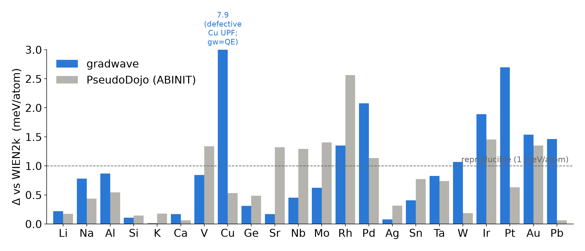
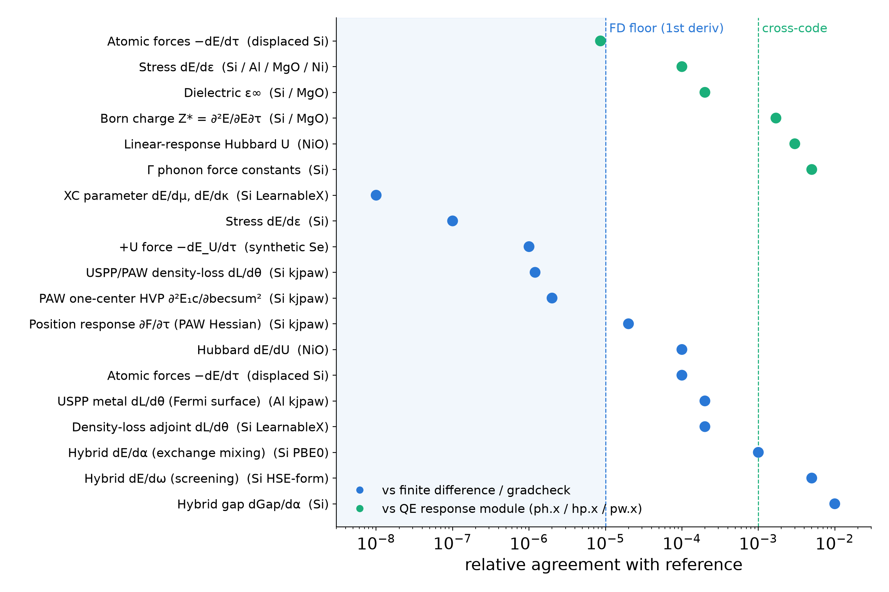
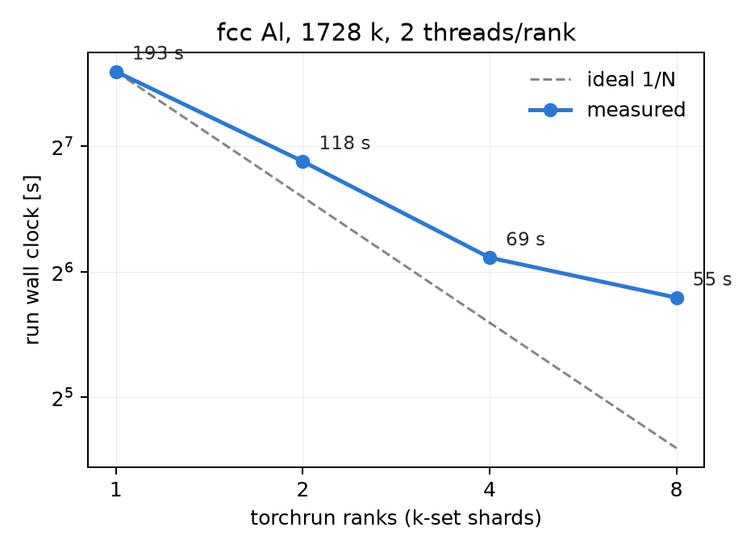
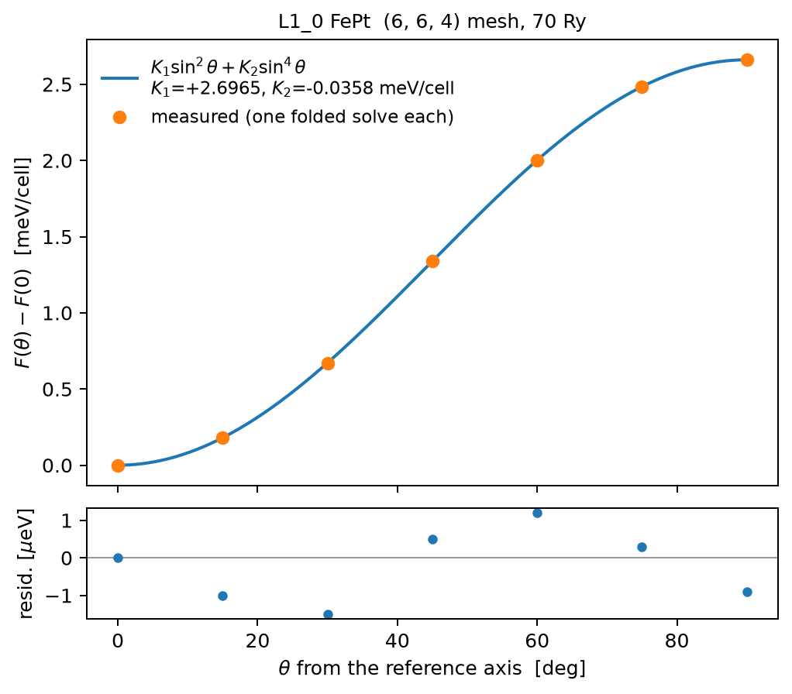
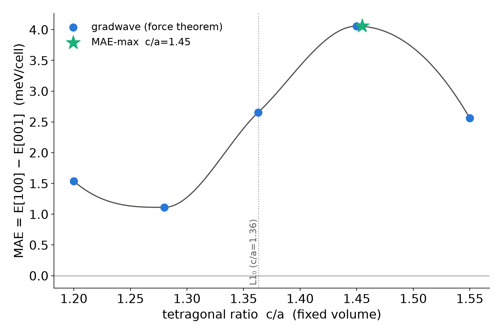
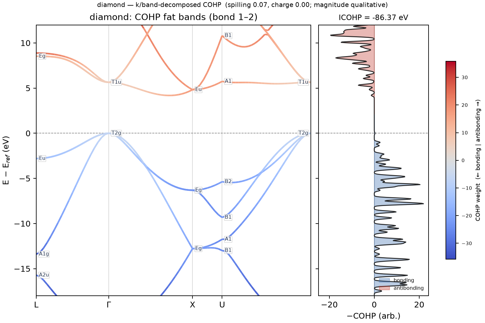
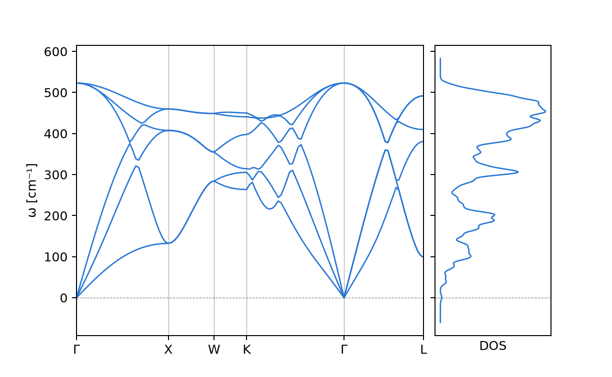
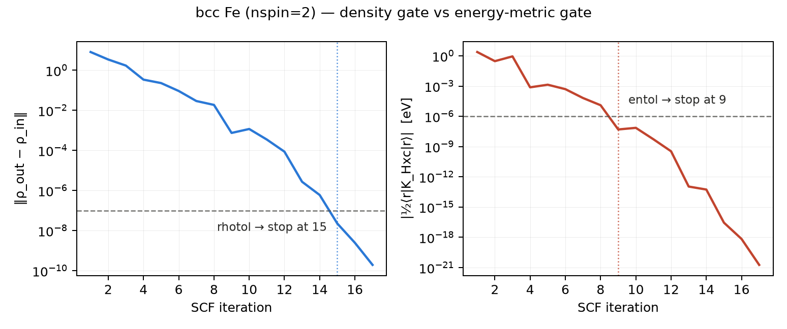

<div align="center">

# gradwave

**Differentiable plane-wave density functional theory for periodic solids, in PyTorch.**

[](https://github.com/wladerer/gradwave/actions/workflows/ci.yml)


</div>

gradwave is my pet project of various electronic structure methods for solids. It is,
for the most part, vibe coded, so please treat it with skepticism and perhaps an iota of
contempt. It is not my intention to masquerade as a gifted method developer. Instead, I
hope this repository demonstrates my attempt to satisfy my curiosity and to fill out the
wishlist of methods I wished I had during my PhD. gradwave is not meant to dethrone
behemoths like VASP or Quantum ESPRESSO, nor is it as mature or rigorous as something
like DFTK.jl.

With the baggage out of the way, I want to explain the overarching philosophy of how I
validate correctness and build trust in gradwave's output. In the beginning, I spent
much time running gradwave and Quantum ESPRESSO calculations side by side to ensure that
I was getting near identical results. When the energies and forces of test cases across insulators, semi-metals, metals, and
magnetic metals matched, I knew I had a relatively reliable core to extend outwards. Since gradwave is written in PyTorch,
automatic differentiation is a built-in feature. This gives us first (and even second)
derivative properties for free. These results were then checked against finite
differences within gradwave as well as with Quantum ESPRESSO. You can even see in the
testing suite that this procedure has been codified as a few unit and integration tests.

<div align="center">

</div>

*Δ against the WIEN2k all-electron reference for 24 cubic elements (norm-conserving
PseudoDojo pseudopotentials), next to PseudoDojo's own published Δ for the same
pseudopotentials. The median is 0.8 meV/atom, inside the 1 meV/atom band that separates
mature codes.*

## Validation

I've been through enough agonizing test cases and sample runs to feel comfortable with
the accuracy of gradwave's output. Still, vibes and "trust me" are probably not
reassuring enough, so I have tried my best to demonstrate gradwave rigorously. In
particular, I implemented the Δ-gauge from Lejaeghere et al.,
[*Reproducibility in density functional theory calculations of solids*, Science **351**,
aad3000 (2016)](https://doi.org/10.1126/science.aad3000) (building on their earlier
Δ-factor, [*Crit. Rev. Solid State Mater. Sci.* **39**, 1 (2014)](https://doi.org/10.1080/10408436.2013.772503)).
The general idea behind it is that for each element you compute the total energy over a
range of unit-cell volumes, fit that E(V) curve to a Birch-Murnaghan equation of state,
and take Δ as the root-mean-square energy difference between gradwave's curve and a
reference code's curve over a ±6% window around equilibrium, normalized per atom. A Δ
below roughly 1 meV/atom is the range that separates mature, production DFT codes, so it
is a stringent and code-agnostic check. As you can see in the figure at the top of the
page, there is a good deal of agreement between gradwave and the PseudoDojo and WIEN2k
references, with some minor exceptions.

The all-electron Δ mixes pseudization with implementation, so a large Δ on a transition
metal is usually the pseudopotential's doing rather than gradwave's. The elevated Pt, Pd, and Ir values are the stiff-metal floor of
the metric, which scales with the bulk modulus, and Cu is a known pseudopotential-file
anomaly that QE reproduces identically (both codes give B₀ = 167 GPa against the
all-electron 141). The element-by-element tracking against PseudoDojo's own Δ is what the
figure really supports. To isolate gradwave itself, a second axis pins it directly
against Quantum ESPRESSO `pw.x` at identical pseudopotential, cutoff, k-mesh, and FFT
grid, so both codes read the same UPF and only the implementation can differ. There the
same elements agree to 0.01 to 0.03 meV/atom, and the QE reference data is committed as
fixtures, so CI reproduces the comparison without running QE.

A representative set of pinned QE comparisons:

| quantity | agreement |
|---|---|
| Si total energy (LDA and PBE, 30 Ry / 408 eV, 4×4×4) | ≤ 0.001 meV/atom |
| Al free energy (PBE, semicore, Gaussian smearing, 40 Ry / 544 eV) | < 2 meV/atom |
| Si forces (displaced, vs `tprnfor`) | < 5 meV/Å |
| Si band structure L–Γ–X–U–Γ (occupied) | < 10 meV |
| bcc Fe magnetic moment (spin-PBE, 60 Ry / 816 eV) | 2.2244 vs 2.22 μB (exp. 2.22) |
| NiO Hubbard U vs `hp.x` DFPT | 6.449 vs 6.431 eV (0.3%) |
| Si Γ phonon (PAW) vs `ph.x` | 0.003% |
| GaAs spin-orbit split-off Δ₀ vs fully-relativistic QE | 0.336 eV, within 2e-3 eV |

The bcc-Fe moment is worth a closer look, because it doubles as a cross-code convergence
study. The PBE moment is sensitive to k-point sampling, and gradwave tracks `pw.x`
point-for-point across both mesh density and smearing scheme, reading the same UPF at
60 Ry / 816 eV:

| k-mesh | gradwave | QE `pw.x` |
|---|---|---|
| 6×6×6 | 2.22 μB | 2.22 μB |
| 8×8×8 | 2.40 μB | 2.40 μB |
| 10×10×10 | 2.22 μB | 2.22 μB |

(Gaussian smearing at 0.1 eV; Methfessel–Paxton and cold smearing give the same values
to within 0.01 μB at every mesh.) The moment does not converge monotonically — it
*oscillates* with k-point sampling, 2.22 → 2.40 → 2.22, a Fermi-surface effect that is
well known for itinerant ferromagnets. The 8×8×8 peak is a sampling artifact, not the
converged value; both meshes that bracket it land back on ≈2.2 μB, consistent with the
experimental moment. What matters for validation is that gradwave reproduces `pw.x`
through the *entire* oscillation — every mesh and every smearing scheme — which is a far
stronger implementation check than agreement at any single settings point.

The derivatives carry their own validation. Each one is checked either against a finite
difference of its own energy, which floors near the finite-difference noise, or against
the specialized QE response module (`ph.x`, `hp.x`), which agrees at the cross-code
level.

<div align="center">

</div>

*Nineteen validated derivatives across the feature set. The finite-difference and
gradcheck comparisons (blue) sit at or below the 1e-5 first-derivative floor, and the
comparisons against a QE response module (green) sit at the 0.1 to 1 percent cross-code
level.*

## Features

In terms of features, there is quite a lot. gradwave is a fully differentiable
plane-wave DFT suite that supports norm-conserving, ultrasoft, and PAW pseudopotentials,
including nonlinear core corrections (NLCC), which you can get from freely available
sources like PseudoDojo, SG15, and SSSP. The input schema is the same across every formalism, which is
detected from the UPF file.

- **Functionals.** LDA, PBE, and the r2SCAN meta-GGA (`xc: r2scan`), transcribed from
  libxc and matched pointwise. Global (PBE0-form) and screened (HSE-form) hybrids with
  exact Fock exchange acting in the SCF. DFT+U with the Hubbard U from linear response.
- **Pseudopotentials.** Norm-conserving (PseudoDojo and SG15 ONCV) and ultrasoft/PAW
  (psl), read directly from the freely available UPF files, with the formalism
  auto-detected.
- **Structure and response.** Total and free energies, Hellmann-Feynman forces, the
  stress tensor, geometry and variable-cell relaxation through any ASE optimizer (with
  selective dynamics via `structure.fixed` and density extrapolation across ionic
  steps), band structures with point-group irrep labels, total and projected (l, m, j)
  DOS, and phonons on both formalisms, the Γ-point analytic response and a supercell
  finite-displacement route for the full dispersion, phonon DOS, and the harmonic
  thermodynamics integrated from it.
- **Equations of state and elasticity.** `task: eos` fits a Birch-Murnaghan curve
  (V₀, B₀, B₀′) to a volume scan, and `task: elastic` builds the 6×6 stiffness tensor
  and Voigt-Reuss-Hill moduli from the analytic stress, clamped-ion or relaxed-ion
  (`elastic.mode: relaxed`).
- **Bonding and charge analysis.** k-resolved COHP bonding analysis, Bader charges,
  and charge-density/ELF/PARCHG export to `.cube`, `.xsf`, and VASP CHGCAR.
- **Dispersion.** Grimme D3(BJ) and D4(BJ) as an opt-in, SCF-independent correction
  with analytic forces and stress, folded into the reported total through the CLI and
  the ASE calculator (`dispersion.method: d3` or `d4`).
- **Magnetism.** Collinear spin, non-collinear magnetism, and spin-orbit coupling from
  fully-relativistic pseudopotentials. Constrained non-collinear moments with
  autograd-exact torques, spin spirals, magnetocrystalline anisotropy, and the exchange
  constants (J, DMI) of a Heisenberg model. The collinear spin-polarized (nspin=2) path
  carries the post-SCF properties (forces, stress, band structures for norm-conserving
  and USPP/PAW, KPM-DOS, ELF, and the dielectric/Born E-field response), along with
  fixed-spin-moment SCF.
- **Brillouin zone.** Symmetry reduction to the irreducible wedge with density and
  becsum symmetrization, including magnetic (Shubnikov) groups for non-collinear cells,
  and Fermi-Dirac, Gaussian, Methfessel-Paxton, and cold smearing for metals.
- **Numerics.** A fully k-batched SCF, batched Davidson and Chebyshev-filtered
  eigensolvers, Pulay/Broyden/Johnson density mixing with Kerker or local
  Thomas-Fermi preconditioning, all in float64/complex128 on CPU and GPU.
- **Convergence control.** An opt-in energy-metric stopping rule
  (`scf.convergence: energy`), a per-iteration SCF flight recorder (`scf.trace`),
  a Stoner preconditioner for the spin channel, and occupation-matrix damping with
  a U-ramp for metallic DFT+U.
- **Parallelism.** `distributed: true` under a torchrun launch shards the k-set
  across processes (multi-core or multi-GPU, single box or several) for `scf`,
  `bands`, `relax`, and `eos` on the norm-conserving and USPP/PAW collinear paths,
  including DFT+U, and composes with IBZ symmetry reduction (the ranks shard the
  reduced k-set).
- **Workflow.** One YAML input file per run, checkpointed restarts
  (`gradwave run -r`), an ASE `Calculator` for driving gradwave from existing ASE
  scripts, and `gradwave plot` figures for scf, bands, DOS/PDOS, COHP, phonons,
  EOS, and elastic results.

## Error estimation

Nobody enjoys running the same calculation at five cutoffs only to learn the first one
was fine. Because a plane-wave cutoff is a variational truncation, the distance to the
converged-basis energy is second order and reachable from a single calculation, so
gradwave estimates the discretization (Ecut) error from one converged run and reports it
alongside the result. The SCF-convergence and smearing
terms come from the same single run. The k-point-sampling term is a quadrature rather
than a variational truncation, so it is reached by a mesh sweep instead, running a few
rising meshes and extrapolating (`examples/kmesh_error.py`). Coverage is broadest
for the energy and density error across the norm-conserving and PAW paths, and the
force and stress error terms carry narrower coverage.

## Performance

gradwave will not out-muscle a Fortran code that has had a decade of tuning, but it is
not slow either. The SCF runs fully k-batched, with a padded `(nk, nb, npw_max)` layout,
batched FFT Hamiltonian applies, a batched Davidson eigensolver, and band-chunked
dense-grid operations to bound GPU memory. `System.to("cuda")` moves a prepared
calculation to the GPU. The wall times below are the same Si SCF (LDA, 30 Ry / 408 eV,
4×4×4) as the optimizations accumulate, across the three machines side by side.

| configuration | wall time |
|---|---|
| per-k Python loop (v0), 8-core laptop CPU | 218 s |
| k-batched + adaptive diagonalization tolerance, 8-core laptop CPU | 33 s |
| + spglib symmetry (36 → 8 k in the IBZ), 8-core laptop CPU | 7.1 s |
| + symmetry, 22-core workstation CPU | 4.6 s |
| + symmetry, RTX 3050 (6 GB) laptop GPU (complex128) | **1.4 s** |

The same calculations across a range of systems, symmetry on, on the 8-core CPU and the
RTX 3050:

| system | atoms | e⁻ | ecut | k (IBZ) | 8-core CPU | RTX 3050 |
|---|---|---|---|---|---|---|
| Si (diamond) | 2 | 8 | 30 Ry / 408 eV | 8 | 6.1 s | 1.4 s |
| GaAs (zincblende, Ga-3d) | 2 | 18 | 40 Ry / 544 eV | 8 | 16.5 s | 2.8 s |
| Al (fcc metal, smeared) | 1 | 11 | 40 Ry / 544 eV | 29 | 13.1 s | 3.9 s |
| MgO (rocksalt) | 2 | 16 | 50 Ry / 680 eV | 8 | 7.0 s | 1.5 s |
| Si₆₄ (2×2×2 supercell, Γ) | 64 | 256 | 30 Ry / 408 eV | 1 | — | 231 s |

The [performance page](docs/manual/performance.md) reports the full matrix and works
through where the small-system gap against a mature Fortran code comes from (fp64
throughput and kernel maturity).

Beyond one process, `distributed: true` under torchrun shards the k-set across
ranks (multi-core or multi-GPU):

<div align="center">

</div>

*The same fcc Al SCF (1728 k, no symmetry, 2 CPU threads per rank) as the k-set
is sharded over torchrun ranks on a 22-core workstation. Every rank count
converges to the same free energy to 2e-12 eV. The 8-rank point flattens on
per-rank setup work and the box's hybrid P/E cores, not on the sharding itself
(`benchmarks/distributed/scaling.py`; the [distributed
page](docs/manual/distributed.md) covers multi-node and multi-GPU launches).*

## Quickstart

Running gradwave is deliberately boring, which is about the highest compliment I can pay
research software. There is one YAML file per calculation, and no Python API to learn
first.

```bash
uv sync                # managed venv with all dependencies
uv run gradwave --help
```

The two examples below optimize the geometry of L1₀ FePt and then compute its band
structure. Run them from the `examples/` directory.

```bash
gradwave fept_relax.yaml    # relax the tetragonal cell and atoms
gradwave fept_bands.yaml    # SCF, then bands along Γ-X-M-Γ-Z
gradwave plot out_fept_bands/bands.json   # write the band-structure figure
```

The relaxation input (`examples/fept_relax.yaml`):

```yaml
structure:
  cell: [[2.723, 0.0, 0.0], [0.0, 2.723, 0.0], [0.0, 0.0, 3.712]]
  positions: {frac: [[0.0, 0.0, 0.0], [0.5, 0.5, 0.5]]}
  species: [Fe, Pt]
pseudopotentials:
  dir: ../tests/fixtures/qe/pseudos
  map: {Fe: Fe.pbe-spn-kjpaw_psl.1.0.0.UPF, Pt: Pt.pbe-n-kjpaw_psl.1.0.0.UPF}
ecut: 680.28          # eV (50 Ry)
ecutrho: 5442.3       # eV (400 Ry); PAW dense-grid cutoff
xc: pbe
kpoints: {mesh: [8, 8, 6]}
smearing: {type: mp1, width: 0.1}   # metal
nspin: 2
start_mag: {Fe: 0.4, Pt: 0.1}
task: relax
relax: {optimizer: bfgs, fmax: 0.02, cell: true}
```

Any geometry format ASE can read is accepted in place of the explicit cell and
positions. See `examples/` for inputs covering relaxation, band structures, magnetism,
and the differentiable workflows.

## Examples

This is the part I have the most fun with. Differentiability lets you ask questions that
are awkward to pose in a conventional code, so here are a handful of worked examples, each
with the script that produced it.

**Magnetocrystalline anisotropy.** The energy cost of rotating the magnetization away
from the easy axis is a spin-orbit effect of a few meV per formula unit. gradwave
evaluates it by the force theorem, one frozen-potential spinor solve per direction,
each folded into that direction's own magnetic (Shubnikov) IBZ.

<div align="center">

</div>

*The anisotropy of L1₀ FePt over the polar angle θ. The E(θ) curve fits
K₁sin²θ + K₂sin⁴θ with microelectronvolt residuals, and the easy axis is [001]
(`examples/fept_mae_map.py`).*

**Strain engineering.** Because the anisotropy is differentiable in the cell, it can be
optimized over strain. Compressing or stretching the FePt c/a ratio at fixed volume
moves the anisotropy by a factor of four, and the peak sits away from the equilibrium
tetragonality.

<div align="center">

</div>

*FePt anisotropy against the tetragonal c/a ratio at fixed volume, by the force theorem.
The anisotropy is maximized near c/a = 1.45, above the L1₀ equilibrium c/a = 1.36
(`benchmarks/mae_inverse/strain.py`).*

**Spin-orbit band inversion.** Bi₂Se₃ is a topological insulator because spin-orbit
coupling inverts the ordering of the band-edge states at Γ. Running the same Γ-Z-F-Γ-L
path with and without the fully-relativistic pseudopotentials shows the inversion
directly.

<div align="center">

</div>

*Bi₂Se₃ bands on a dense 160-k-point path, scalar-relativistic (grey) against
fully-relativistic with spin-orbit coupling (red), both referenced to the valence-band
maximum. SOC opens and inverts the Γ gap (`examples/bi2se3_bands_compare.py`).*

**Chemical bonding.** The COHP projection decomposes the band structure onto a
bond, so each state carries a bonding or antibonding weight and the band picture
connects to the chemistry.

<div align="center">

</div>

*The diamond C-C bond. Each (k, band) state is colored by its COHP weight on the
nearest-neighbor bond (bonding blue, antibonding red), with point-group irrep
labels at the special points, and the right panel is the energy-resolved −COHP. The
occupied valence bands are bonding and the conduction bands antibonding, the
textbook picture of the covalent bond (`examples/cohp_fatbands.py`).*

**Equation of state.** `task: eos` scans the volume with warm-started SCFs on a
shared FFT grid and fits the third-order Birch-Murnaghan form.

<div align="center">

</div>

*Silicon equation of state, seven SCF points and the Birch-Murnaghan fit. gradwave
(PBE) gives V₀ = 20.57 ų/atom, B₀ = 87.8 GPa, B₀′ = 4.21, against the WIEN2k
all-electron reference V₀ = 20.45 ų/atom, B₀ = 88.5 GPa
(`examples/eos_silicon.py`).*

**Phonon dispersion.** `task: phonons` displaces the two home-cell atoms in a
supercell (12 SCFs, independent of supercell size), builds the force constants
from the autograd forces, and Fourier-interpolates the dynamical matrix to any q.

<div align="center">

</div>

*Si phonons on a 2×2×2 supercell along Γ-X-W-K-Γ-L with the DOS from an 8×8×8
q-mesh. The Γ optical mode comes out triply degenerate at 523 cm⁻¹ (experiment:
519), the acoustic branches go to zero at Γ, and no mode is imaginary
(`examples/si_phonons.yaml`, plotted by `gradwave plot`).*

**Stopping on the energy, not the density.** The free energy converges
quadratically in the density residual, and its exact second-order error is
½⟨r|K_Hxc|r⟩, evaluable each iteration from the response kernel the mixer
already uses. The opt-in energy-metric gate (`scf.convergence: energy`) stops
on that number, and the per-iteration flight recorder (`scf.trace`) makes both
measures visible.

<div align="center">

</div>

*One spin-polarized SCF on bcc Fe (m = 2.224 μB). The density gate at
rhotol = 1e-7 polishes until iteration 15. The energy gate at entol = 1e-6 eV
stops at iteration 9, where the energy error is already 5e-8 eV
(`examples/fe_energy_gate.py`).*

## Development

If you want to poke under the hood, the loop is quick. The fast gate runs in about 80
seconds, so the edit-test cycle stays tight.

```bash
uv sync
uv run pytest -m "not standard and not slow and not torture and not gpu"   # fast gate, ~80 s
uv run ruff check      # lint
uv run ty check        # types (error-level on the typed-file list)
uv run lint-imports    # import contracts
```

The `Makefile` wraps the common flows in `uv run` with the correct tier markers.
`make hooks` installs the pre-commit hooks once per clone, `make check` runs lint
plus the fast gate, and `make test-fast` / `make test-standard` select a tier.
`CONTRIBUTING.md` covers the setup, the test tiers, and the definition of done.

The suite is tiered by pytest marker. Unmarked tests are the fast tier.

| tier | select | wall time | when |
|---|---|---|---|
| fast | `-m "not standard and not slow and not torture and not gpu"` | ~80 s | every commit |
| standard | `-m "not slow and not torture and not gpu"` | ~10 min | CI |
| nightly | `-m "not torture and not gpu"` | hours | nightly / pre-release |
| torture | `-m torture` | >10 min each | manual, when the subsystem changes |

Reference data is generated against Quantum ESPRESSO `pw.x` with the same UPF files
(`tests/fixtures/qe/regenerate.py`, QE via `nix shell nixpkgs#quantum-espresso`). CI
runs ruff, ty, lint-imports, and the sharded standard tier on every pull request.

## Documentation and license

The manual is a mkdocs site under `docs/manual/`. Build it locally with
`uv run --group docs mkdocs serve`. It covers installation, a cookbook of task recipes,
tutorials for the differentiable workflows, and the API reference. gradwave is released
under the MIT license.
