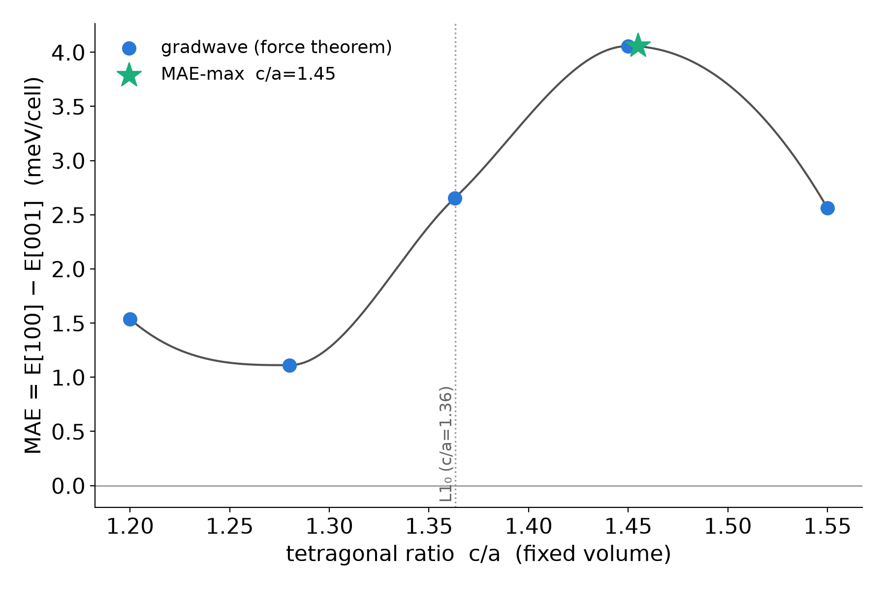

# Inverse design of FePt anisotropy by tetragonal strain

L1₀ FePt is a benchmark high-anisotropy magnet; its magnetocrystalline
anisotropy energy (MAE) is what lets a nanograin hold its magnetization at room
temperature. The anisotropy is a spin-orbit effect and depends sharply on the
tetragonal distortion c/a, so strain is a design knob. The scan maps MAE(c/a) and
locates the c/a that maximizes it, the tetragonality a substrate would impose for
maximum anisotropy.

## Method

Each c/a is one **spinor spin-orbit ground state** (`scf_noncollinear` on
fully-relativistic Fe/Pt pseudopotentials) followed by the **magnetic force
theorem** (`postscf/mae.py`): freeze the converged (ρ, m⃗) of the [001] reference,
rigidly rotate the moment to [100], rebuild the frozen-potential Hamiltonian,
diagonalize once, and difference the occupied band energies,

    MAE = F[100] − F[001]   (positive → easy axis along c).

The MAE is a meV-scale difference of large numbers and its **sign is
k-mesh-sensitive** (a coarse mesh flips the easy axis), so the anisotropy is
evaluated on a dense mesh. The density, which is not mesh-sensitive, converges on
a coarse mesh; `force_theorem_mae(system=…)` then evaluates on the dense mesh over
the same (pinned) FFT box. The volume is held fixed so the scan isolates the
shape (tetragonality) effect.

Runs on CPU — the 6 GB GPU cannot hold the 144-k spinor Hamiltonian at 70 Ry.

    GW_DEVICE=cpu uv run python benchmarks/mae_inverse/strain.py
    uv run python benchmarks/mae_inverse/make_fig.py

`strain.json` holds MAE, moment, and timing per ratio; `mae_strain.png` is the
landscape with the MAE-maximizing c/a marked.

## Result

Five spinor SOC ground states (70 Ry, 6×6×4, ~40 min each on the 22-core CPU),
fixed volume, c/a from 1.20 to 1.55:

| c/a | 1.20 | 1.28 | 1.363 (L1₀) | 1.45 | 1.55 |
|---|---|---|---|---|---|
| MAE (meV/cell) | +1.54 | +1.11 | +2.66 | **+4.06** | +2.56 |
| \|M\| (μB) | 3.41 | 3.32 | 3.22 | 3.18 | 3.10 |

The easy axis is c throughout (MAE > 0), and the landscape is **non-monotonic** —
a shallow dip near c/a = 1.28, then a sharp rise to a **maximum at c/a ≈ 1.45**,
where the anisotropy is **+4.06 meV/cell, 53 % above the equilibrium L1₀ value**.
That non-trivial structure reflects the spin-orbit band physics. The anisotropy
is a Fermi-surface property and shifts as tetragonality moves bands through E_F,
so a plausible design target ("just stretch it") has a real optimum, one gradwave
locates directly.

The c/a = 1.363 point reproduces the published force-theorem MAE (+2.67) and
moment (3.22 μB) of `examples/fept_mae*.py`, which validates the pipeline. The
self-consistent reference there is +2.55 meV/cell.
