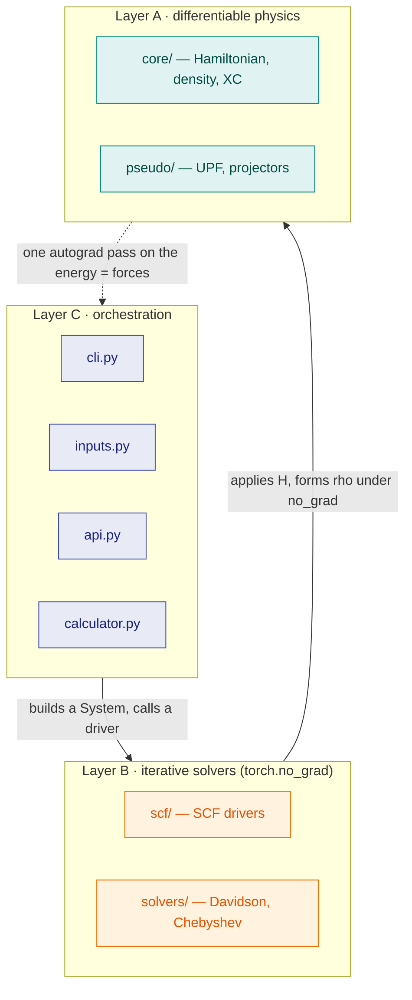
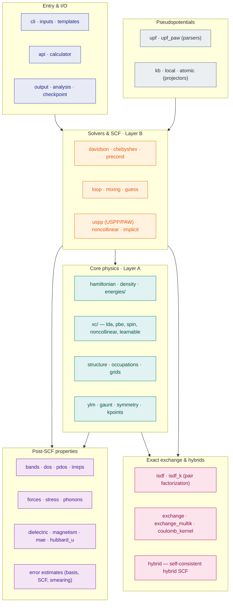
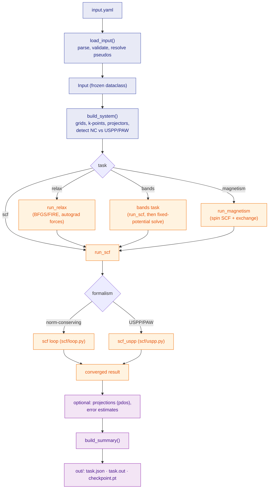
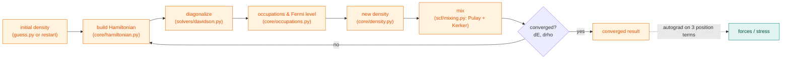

# Architecture

This page is a map of the code: the layers it is built in, how the modules
group into subsystems, and the path a calculation takes from a YAML file to its
output. Read it when you are trying to find where a feature lives or how the
pieces connect. The [Inputs and outputs](io.md) page covers the input schema;
this page covers the machinery behind it.

## The three layers

gradwave is organized so that automatic differentiation can pass cleanly through
the physics while the iterative solvers stay out of the tape. Every module
belongs to one of three layers, and the contract between them is what keeps the
gradients exact.

**Layer A — differentiable physics (`core/`, `pseudo/`).** Pure PyTorch, no
in-place mutation, everything traceable by autograd. The Hamiltonian apply, the
density, the exchange-correlation functionals, the structure factors, and the
per-term energy assembly live here; `core/energies/total.py` is the single
function autograd differentiates. This is the only layer the tape ever sees, so
a reverse-mode pass through the total energy yields the forces, and
differentiating the forces again yields the Hessian, one Hessian-vector product
per column.

**Layer B — iterative solvers (`scf/`, `solvers/`).** The self-consistency loop
and the eigensolvers run under `torch.no_grad`. Autograd must never trace
Davidson or the SCF iteration; instead the converged density and wavefunctions
are detached, and the gradient is recovered analytically (stationarity for
`dE/dtheta`, an implicit-differentiation solve for the density response). This
boundary is the single most important invariant in the codebase.

**Layer C — orchestration (`api.py`, `inputs.py`, `cli.py`, `calculator.py`).**
The user-facing surface. `inputs.py` parses YAML into a frozen `Input`, `api.py`
builds the `System` and dispatches the task, and `cli.py` and `calculator.py`
are the two front doors (command line and ASE calculator).

Post-SCF properties (`postscf/`) sit above this stack: each one takes a
converged result and computes a property, often by running one more autograd
pass through the Layer A energy (forces, stress, phonons, dielectric response).

## Subsystem map

The same modules, grouped by what they do rather than by layer.

## Anatomy of a run

What happens between `gradwave input.yaml` and the files in `out/`. The formalism
(norm-conserving versus ultrasoft/PAW) is detected from the UPF files, so one
input schema drives both paths and they rejoin at the summary.

## Inside the SCF loop

The self-consistency cycle is the heart of Layer B. It runs under `torch.no_grad`;
the density and wavefunctions it returns are detached, and forces come afterward
from a single autograd pass through the three position-dependent energy terms
(the structure factors, the Ewald sum, and the nonlocal projector phases).

## Where each feature lives

If you are trying to find the module behind a capability, start here. The input
column is the YAML keyword (or API entry point) that turns the feature on; see
[Inputs and outputs](io.md) for the full schema.

| Feature | Turn it on with | Lives in | Tutorial |
|---|---|---|---|
| Single-point SCF | `task: scf` | `scf/loop.py`, `scf/uspp.py` | [Cookbook](cookbook.md) |
| Exchange-correlation | `xc: lda \| pbe` | `core/xc/` | [Learning XC](learning-xc.md) |
| Geometry / cell relaxation | `task: relax` | `postscf/forces.py`, `postscf/stress.py` | [Geometry optimization](geometry-optimization.md) |
| Band structure | `task: bands` | `postscf/bands.py`, `postscf/irreps.py` | [Symmetry](symmetry.md) |
| Density of states | `task: bands` / plot | `postscf/dos.py` | [Cookbook](cookbook.md) |
| Projected DOS | `projections:` | `postscf/pdos.py`, `core/hubbard.py` | [Cookbook](cookbook.md) |
| Collinear spin | `nspin: 2`, `start_mag:` | `core/xc/spin.py`, `scf/loop.py` | [Magnetism](magnetism.md) |
| Noncollinear / SOC | `noncollinear: true` | `scf/noncollinear.py`, `core/spinor_proj.py` | [Noncollinear & SOC](noncollinear-soc.md) |
| Exchange couplings (J) | `task: magnetism` | `postscf/magnetism.py`, `postscf/spin_exchange.py` | [Magnetism](magnetism.md) |
| Magnetic anisotropy | API | `postscf/mae.py` | [MAE](mae.md) |
| Hubbard U (+U and its response) | API | `core/hubbard.py`, `postscf/hubbard_u.py` | [Hubbard U](hubbard-u.md) |
| Phonons | API | `postscf/phonons.py`, `postscf/hessian.py` | [Cookbook](cookbook.md) |
| Dielectric / Born charges | API | `postscf/dielectric.py` | [Cookbook](cookbook.md) |
| Symmetry reduction | `symmetry: true` | `symmetry.py`, `scf/paw_symmetry.py` | [Symmetry](symmetry.md) |
| Smearing (metals) | `smearing:` | `core/occupations.py` | [Cookbook](cookbook.md) |
| Learnable functionals | API | `core/xc/learnable.py`, `scf/implicit.py` | [Learning XC](learning-xc.md) |
| Hybrid functionals (exact exchange) | `hybrid_scf` (Python) | `postscf/hybrid.py`, `postscf/isdf.py`, `postscf/exchange.py` | — |
| Learnable hybrid (α, ω) | Python | `postscf/exchange_multik.py`, `postscf/isdf_k.py`, `postscf/coulomb_kernel.py` | — |
| Basis / SCF error estimates | `error_estimate: true` | `postscf/convergence_error.py`, `postscf/discretization_error.py` | [Error estimation](error-estimation.md) |
| Restart / checkpoints | `restart:` | `checkpoint.py` | [Inputs and outputs](io.md) |
| ASE calculator | Python | `calculator.py` | [Cookbook](cookbook.md) |

## Pseudopotentials

The formalism is chosen by the UPF file, not the input. `pseudo/upf.py` parses
norm-conserving UPF v2; `pseudo/upf_paw.py` parses ultrasoft and PAW. The
projector modules (`kb.py`, `local.py`, `atomic.py`) build the Kleinman-Bylander
nonlocal projectors, the local potential, and the atomic-orbital projectors used
for the projected DOS and Hubbard manifolds. Everything downstream of the parser
is formalism-agnostic until the SCF driver forks.

## Exact exchange and hybrid functionals

Hybrid functionals add a fraction of exact (Fock) exchange to a semilocal
functional. The naive Fock build scales as O(N⁴), so this subsystem is built on
interpolative separable density fitting (ISDF), the plane-wave form of tensor
hypercontraction, which factorizes the orbital-pair products into a low-rank
form. `isdf.py` and `isdf_k.py` do that factorization at Γ and across a k-mesh;
`exchange.py` and `exchange_multik.py` build the Fock operator (and its
adaptively-compressed ACE form) from it; `coulomb_kernel.py` supplies the
range-separated kernel that distinguishes full (PBE0-style) from screened
(HSE-style) exchange. `hybrid.py` ties these into the SCF loop with
`hybrid_scf`, so gradwave can solve a hybrid self-consistently rather than only
evaluate exchange on a fixed density. The mixing fraction α and screening length
ω are differentiable parameters (`HybridExchangeParams`), which makes a
*learnable* hybrid trainable end to end, the same stationarity argument the
learnable-XC slot uses.

This subsystem is reached from Python today (`hybrid_scf`,
`HybridExchangeParams`); it is not yet wired into the YAML input schema. The
`xc:` key accepts `lda`, `pbe`, and `r2scan`; the hybrids stay Python-only.

## Tests and fixtures

The physics is pinned against Quantum ESPRESSO. `tests/fixtures/qe/` holds the
reference outputs and the UPF pseudopotentials the tests read; the same
pseudopotential directory backs the `examples/` inputs and the `gradwave init`
templates. Tests are tiered by cost: the default fast tier runs small
configurations in seconds, `-m standard` runs real SCFs, and `-m slow` runs the
converged QE comparisons (minutes). When a test references a QE fixture, it is
asserting that gradwave reproduces that reference to a stated tolerance.
