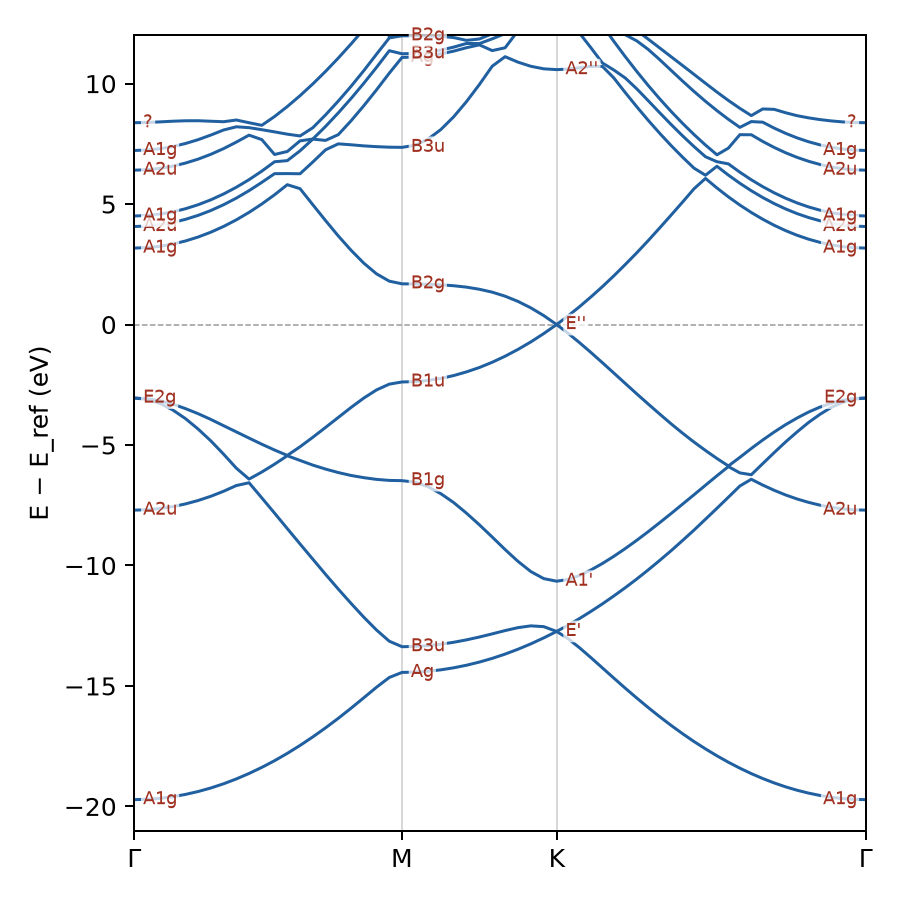

# Cookbook

Task recipes for someone who has a structure and a pseudopotential and wants a
result now. Each entry is the shortest path to one quantity. The tutorials carry the
theory and the validation behind each of these. The full input schema is on the
[Inputs and outputs](io.md) page.

Every calculation needs three things, a `structure`, a `pseudopotentials` block, and an
`ecut` in eV. Everything else has a default. Energies are eV and lengths are Å.

## Ground-state SCF

Minimal input, a total energy and the converged density.

```yaml
# si_scf.yaml
structure:
  cell: [[0.0, 2.715, 2.715], [2.715, 0.0, 2.715], [2.715, 2.715, 0.0]]
  positions: {frac: [[0.0, 0.0, 0.0], [0.25, 0.25, 0.25]]}
  species: [Si, Si]
pseudopotentials:
  dir: tests/fixtures/qe/pseudos
  map: {Si: Si_ONCV_PBE-1.2.upf}
ecut: 408.0            # eV (30 Ry)
xc: pbe
kpoints: {mesh: [4, 4, 4]}
```

```bash
gradwave si_scf.yaml -o out/
```

`out/scf.out` is the human report, `out/scf.json` the parsing target, and
`out/checkpoint.pt` a restartable density.

## SCF from Python

The ASE calculator returns the energy of an `Atoms` object.

```python
from ase.build import bulk
from gradwave.calculator import GradWave

atoms = bulk("Si", "diamond", a=5.43)
atoms.calc = GradWave(
    ecut=408.0,
    pseudopotentials={"Si": "tests/fixtures/qe/pseudos/Si_ONCV_PBE-1.2.upf"},
    xc="pbe", kpts=(4, 4, 4),
)
atoms.get_potential_energy()   # eV
atoms.get_forces()             # (na, 3) eV/Å, exact autograd Hellmann-Feynman
```

## Relax a geometry

Set `task: relax`. BFGS is the default and is right near a smooth minimum. Use
`fire` for a hard start.

```yaml
task: relax
relax: {optimizer: bfgs, fmax: 0.01}   # eV/Å
```

Add `relax: {cell: true}` for a variable-cell relaxation through `FrechetCellFilter`.
Depth and the Pulay-stress caveat are in
[Geometry optimization](geometry-optimization.md).

## Band structure

Run `task: bands` after an SCF-quality density. The `path` is an ASE bandpath
string, and empty uses the lattice default.

```yaml
task: bands
bands: {path: LGXUG, npoints: 120, irreps: false}
```

```bash
gradwave bands.yaml -o out/
gradwave plot out/bands.json
```

Set `irreps: true` to label bands at the special points with Mulliken symbols.



*Graphene along Γ-M-K-Γ, each state at a special point labeled with its
point-group irrep.*

## Density of states

A total DOS comes from any SCF result at plot time.

```bash
gradwave plot out/scf.json --kind dos --width 0.2
```

For a projected DOS, add `projections` to the SCF input. This needs a
pseudopotential carrying atomic orbitals (`PP_PSWFC`).

```yaml
projections: {enabled: true, group_by: l, width: 0.1}
```

```bash
gradwave plot out/scf.json --kind pdos
```

## Collinear spin

Set `nspin: 2` and seed a moment fraction per element. The converged moment is reported.

```yaml
nspin: 2
start_mag: {Fe: 0.4}
smearing: {type: gaussian, width: 0.1}
```

Non-collinear moments, spin-orbit coupling, and exchange constants are in
[Non-collinear magnetism and SOC](noncollinear-soc.md) and
[Magnetic structure and spin Hamiltonians](magnetism.md).

## Check the cutoff without a sweep

Add one line to an `scf` calculation and the report gains a basis-set error estimate, the
energy the cutoff is converging to, from a single calculation.

```yaml
output: {error_estimate: true}
```

The method and its coverage are in
[Basis-set error estimation](error-estimation.md).

## Load a result for analysis

The analysis helpers return tidy pandas frames and matplotlib figures.

```python
from gradwave import analysis
r = analysis.load("out/scf.json")

analysis.scf_frame(r)             # iter, free_energy_eV, dE_eV, drho
analysis.eigenvalues_frame(r)     # spin, k, kweight, band, energy_eV, occupation
analysis.plot_bands(r, path="bands.png")
analysis.plot_dos(r, path="dos.png")
```

A `relax.json` trajectory reads straight into pandas, shown in the
[geometry optimization tutorial](geometry-optimization.md#plot-the-trajectory).

## Move a calculation to GPU

Prepare on the CPU, then move the whole `System` before the SCF.

```python
system = system.to("cuda")
```

The GPU is worth using once the cell reaches production size. On small cells the
fp64 cost on a consumer card is slower than the CPU, worked through on the
[Performance](performance.md) page.
