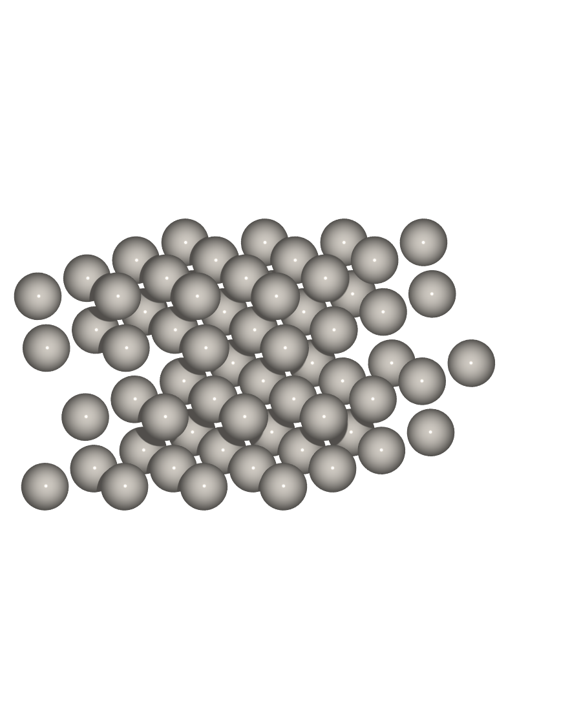
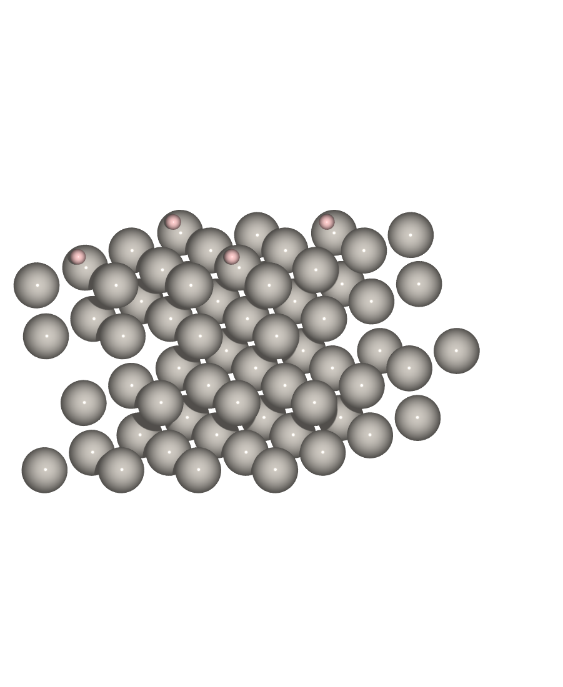
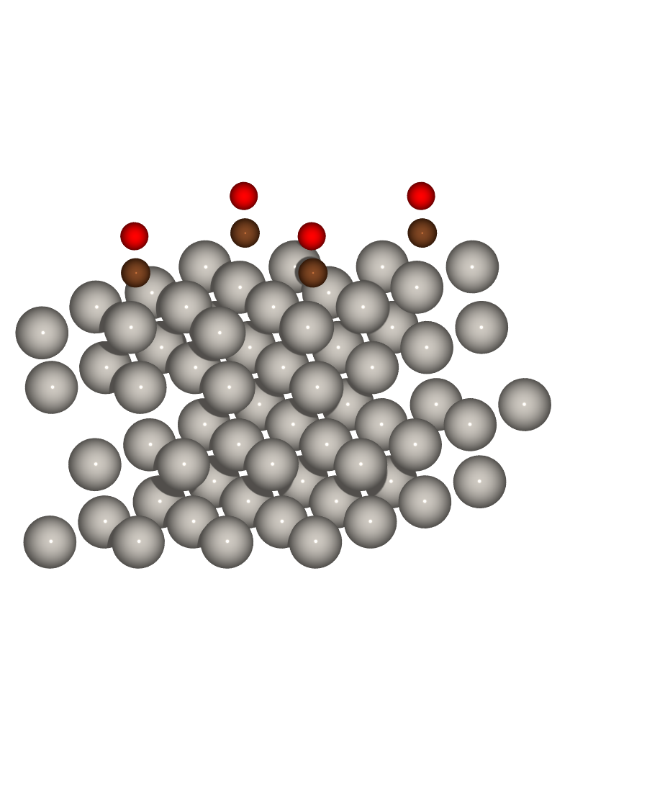
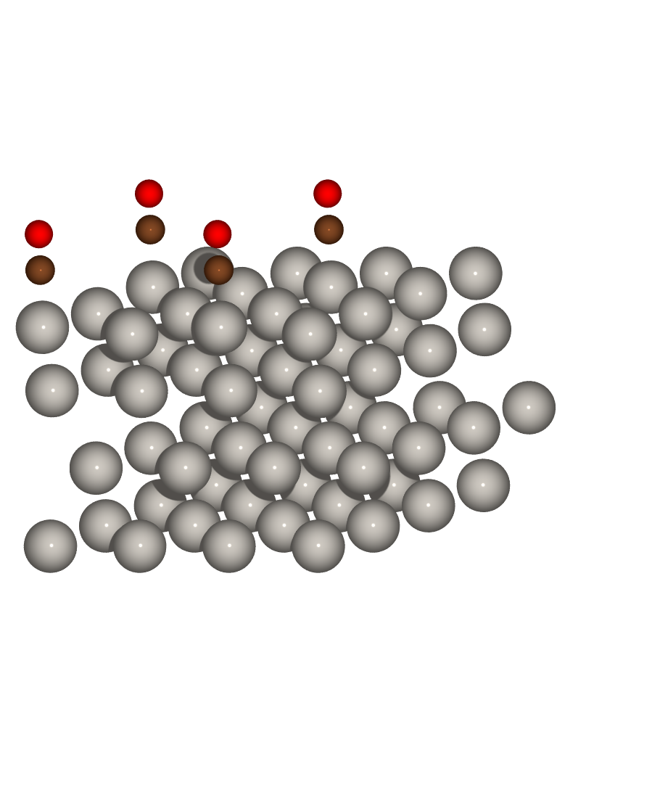

# Adsorption and constant-potential electrochemistry

This chapter computes hydrogen and CO adsorption free energies on Pt(111), then the
electrode potential from a constant-µ SCF. The energetics use the computational
hydrogen electrode. The electrode potential uses the open-boundary (ESM)
electrostatics, where the electron count floats to a fixed Fermi level and metal
plates carry the counter-charge. The shipped example is in `experiments/electrocat/`,
and every calculation here ran on one GPU.

## Theory

### Adsorption free energy and the computational hydrogen electrode

The adsorption free energy of a reaction intermediate is referenced to gas-phase
species through the computational hydrogen electrode[[44]](bibliography.md#che). A
proton-electron pair in solution is set equal to half a hydrogen molecule at zero
volts on the reversible hydrogen electrode. The hydrogen descriptor is then
$\Delta G_{\mathrm{H}^*} = \Delta E + \Delta\mathrm{ZPE} - T\Delta S$ at 298 K,
where $\Delta E$ is the electronic adsorption energy against the clean slab and
$\tfrac{1}{2}\mathrm{H_2}$, and the remaining terms are the standard tabulated
zero-point and entropy aggregates.

### Open-boundary electrostatics and the constant-µ SCF

A periodic plane-wave code repeats the slab in all three directions, so a charged
slab couples to its images along the surface normal. The effective screening medium
method removes the coupling along that axis by solving the Poisson equation with
open boundary conditions[[43]](bibliography.md#otani). Per in-plane reciprocal
vector $G_\parallel$ the one-dimensional equation
$(\partial_z^2 - |G_\parallel|^2)\,v = -4\pi e^2 \rho$ is solved on the box, with the
boundary condition set by the mode. For an isolated slab the potential decays to
zero on both faces (`boundary: open_z`). For an electrode the box edges are grounded
metal planes that carry the counter-charge (`boundary: open_z_metal`), with an
optional applied bias.

At a fixed electron count the electrode sits at whatever Fermi level the charge
dictates. A real electrode holds the potential fixed. The constant-µ SCF fixes the
Fermi level $\mu$ and lets the electron count float, recomputing
$N = \sum_k w_k \sum_n g\, f\!\left((\varepsilon_n - \mu)/\sigma\right)$ from the
occupied states each iteration, with the plates carrying the excess charge. The
grand potential $\Omega = F - \mu N$ is the quantity minimized at fixed $\mu$.

The work function is $\Phi = E_\mathrm{vac} - E_F$, read from the planar-averaged
potential in the vacuum region and the Fermi level. The absolute electrode potential
on the standard hydrogen electrode scale is $U = \Phi/e - 4.44\,\mathrm{V}$, using
the Trasatti value for the absolute SHE potential[[45]](bibliography.md#trasatti).

## The surface

Build the input structures once.

```bash
uv run python structures.py
```



The slab is a 2×2×4 Pt(111) cell with 15 Å of vacuum, the bottom two layers held
at the PBE lattice constant a = 3.968 Å. PAW pseudopotentials (psl.1.0.0, PBE) run
at ecutwfc = 50 Ry and ecutrho = 400 Ry, on a 4×4×1 k-mesh with cold smearing at
0.15 eV. A vacuum slab converges in fewer iterations with the local Thomas-Fermi
preconditioner than with a constant Kerker[[22]](bibliography.md#kerker) screening,
because a fixed screening over-damps the vacuum region. The preconditioner and
Johnson[[38]](bibliography.md#johnson) mixing are set in `config.py`.

## Hydrogen adsorption

`run_pair.py` runs one adsorbate-surface pair from start to finish. It relaxes the
clean slab, relaxes the adsorbate at the ontop, bridge, fcc, and hcp sites, relaxes
the gas-phase reference, and forms the adsorption free energy.

```bash
uv run python run_pair.py Pt H
```

H binds most strongly in the threefold fcc hollow at ΔE = −0.48 eV, with the hcp
hollow weaker by 0.05 eV and the atop site weaker by 0.07 eV.



On Pt(111) at 1/4 ML the hydrogen descriptor is ΔG_H* = −0.243 eV. A |ΔG_H*| near
zero is the condition for fast hydrogen evolution, and Pt is the reference catalyst
against which the descriptor was calibrated.

## The CO puzzle

CO on Pt(111) is a standard failure of semilocal DFT. PBE places CO in a threefold
hollow, whereas the experiment finds it atop. The workflow reproduces the site error
and the overbinding together.

```bash
uv run python run_pair.py Pt CO --skip bridge
```

The `--skip bridge` flag drops the bridge site, which relaxes into a hollow anyway.

CO binds most strongly in the hcp hollow at ΔE = −1.742 eV, with the fcc hollow
within 0.01 eV and the atop site weaker by 0.17 eV. The adsorption free energy at
the hollow is ΔG = −1.642 eV.



PBE selects the hollow, and it overbinds relative to the experimental adsorption
energy near −1.4 to −1.5 eV. The atop geometry that the experiment prefers is the
weaker-binding site here.



## Electrode potential from a constant-µ SCF

The adsorption energetics hold the electron count fixed. Typically the fixed
potential of an electrode is reached with a charged periodic cell and a compensating
background. Instead gradwave uses the open-boundary electrostatics, where metal
plates at the cell edges carry the counter-charge, and floats the electron count to
a target Fermi level. The constant-µ SCF is wired for the norm-conserving path, so
the example uses the ONCV Pt pseudopotential at ecutwfc = 80 Ry.

```bash
uv run python constant_potential.py
```

At the potential of zero charge the neutral slab gives a work function Φ = 5.53 eV,
and an absolute electrode potential of Φ − 4.44 = +1.09 V versus SHE. Literature
values are 5.9 eV from experiment and about 5.7 eV in PBE, so Φ here is comparable
to the PBE reference at this smearing. From the fixed-µ runs the electron count
floats away from neutrality, and its slope ∂N/∂µ is the differential capacitance of
the interface.

## Convergence on a transition metal

The constant-µ SCF converges at once on a free-electron metal like Na. On Pt it does
not, and the reason is the d-band. At a fixed Fermi level the electron count is
recomputed from the occupied states each iteration. Pt has a large density of states
at the Fermi level, so ∂N/∂µ is large, and with a sharp 0.1 eV smearing the floating
electron count oscillates and the SCF never settles. The neutral fixed-count run
converges without trouble, so the µ constraint is the difficulty, not the metal
itself.

You have a few options. Broadening the smearing to 0.3 eV shrinks ∂N/∂µ and is
enough here. Warm-starting each fixed-µ run from the converged neutral density means
only the electron count has to move, not the whole density. The local Thomas-Fermi
preconditioner damps the charge sloshing between the slab and the plates. The
principled fix is to deflate the soft mode of the charge response, the near-singular
mode with large ∂N/∂µ that the instability follows.

## What each run writes

Every stage writes to `results/`. The energies land in `<pair>.json` as they
converge, so a re-run skips finished stages. Each relaxation writes the final
geometry to `<tag>_relaxed.xyz` with forces, the full trajectory to `<tag>.traj`,
and a diagnostics sidecar `<tag>.diag.json` recording the SCF iteration count, the
Fermi level, whether fractional occupations exist, and whether the optimizer reached
the force threshold. A gas molecule is flagged non-metallic in that sidecar, which
is correct.

## What is differentiable

Every number above is an energy from a converged SCF. Because the SCF is
differentiable, its derivatives follow from autograd without a finite-difference
sweep. `differentiable.py` reads the strain derivative of the adsorption energy from
the autograd stress, one calculation rather than a lattice scan. The same route
gives the derivative with respect to the electrode potential through the constant-µ
SCF, and with respect to composition through the alchemical path.
