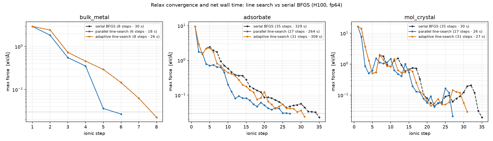

# Geometry optimization

This tutorial relaxes diamond carbon. The second atom starts about 0.08 Å off its
ideal (a/4, a/4, a/4) site and BFGS moves it back.

## Theory

The total energy is a function of the nuclear positions $\{\mathbf{R}_I\}$. The
force on atom $I$ is the negative gradient,

$$ \mathbf{F}_I = -\frac{\partial E}{\partial \mathbf{R}_I}. $$

At self-consistency the energy is stationary with respect to the density, so the
implicit dependence of the wavefunctions on $\mathbf{R}_I$ drops out of the
gradient. Only the explicit dependence of the Hamiltonian survives, which is the
Hellmann-Feynman theorem,[[3]](bibliography.md#feynman)

$$ \mathbf{F}_I = -\left\langle \psi \left| \frac{\partial \hat{H}}{\partial \mathbf{R}_I} \right| \psi \right\rangle. $$

gradwave does not implement this explicitly. It differentiates the detached converged
energy with one reverse-mode pass, so the positions enter through the Ewald sum,
the structure factors, and the projector phases, and the result matches the
Hellmann-Feynman force to autograd precision. A relaxation drives the largest
force below a threshold,

$$ \max_I \left| \mathbf{F}_I \right| < f_\text{max}, $$

by a quasi-Newton method. The default is BFGS,[[8]](bibliography.md#nw) which
builds an approximate inverse Hessian from the force history and is efficient near
a smooth minimum. FIRE[[9]](bibliography.md#fire) is the robust fallback for
starts far from the minimum. For a variable cell the stress tensor is the strain
derivative,

$$ \sigma_{\alpha\beta} = \frac{1}{\Omega} \frac{\partial E}{\partial \varepsilon_{\alpha\beta}}, $$

which gradwave also obtains by autograd through the differentiable radial
transforms.

### Stress convergence in the plane-wave cutoff

The stress converges more slowly in the plane-wave cutoff than the total energy.
The energy is variational, so its basis-set error is second order in the cutoff,
while the stress is a first derivative and its error is first order. A cutoff
that converges the energy can therefore leave the stress far from converged, and
a variable-cell relaxation that follows an unconverged stress relaxes to the
wrong cell, sometimes collapsing it.

The gap is worst for hard pseudopotentials with deep semicore states. A
norm-conserving semicore pseudopotential can need more than 100 Ry for a
converged stress where the energy is already converged near 50 Ry, and the
unconverged stress carries the wrong sign and several times the right magnitude.
Converge the stress against the cutoff before trusting a cell relaxation. A
softer ultrasoft or PAW pseudopotential is the practical remedy, since it
converges the stress at a much lower cutoff, often near the energy's.

## Write the input

`examples/input_diamond_relax.yaml`:

```yaml
structure:
  cell: [[0.0, 1.7835, 1.7835], [1.7835, 0.0, 1.7835], [1.7835, 1.7835, 0.0]]
  positions:
    cart: [[0.0, 0.0, 0.0], [0.9518, 0.8618, 0.9318]]   # ideal: 0.89175 each
  species: [C, C]

pseudopotentials:
  dir: ../tests/fixtures/qe/pseudos
  map: {C: C_ONCV_PBE-1.2.upf}

ecut: 680.28          # eV (50 Ry, hard C ONCV pseudo)
xc: pbe
kpoints: {mesh: [4, 4, 4]}

scf:
  etol: 1.0e-8
  rhotol: 1.0e-7

task: relax
relax:
  optimizer: bfgs
  fmax: 0.01          # eV/Å
  max_steps: 100

output:
  dir: ./out_diamond
```

`ecut` is in eV. `fmax` is the force threshold $f_\text{max}$ in eV/Å. The
optimizer default is `bfgs`, which is right for a smooth problem near the minimum.
Use `fire` when the start is far from the minimum or the surface is rough.

## Run it

    uv run gradwave examples/input_diamond_relax.yaml -o out_diamond/

ASE prints the BFGS log as it runs, one line per ionic step with the energy and
the maximum force. The final line reports whether the calculation converged, the energy,
the fmax reached, and the step count.

## Read the output

Three files are written to `out_diamond/`.

- `relax.out` is the human report. Structure, parameters, the ionic step table,
  and the final geometry.
- `relax.json` is the machine-readable summary and the parsing target. The
  `relax` block holds `converged`, `n_steps`, `energy_eV`, `fmax_eV_ang`,
  `max_displacement_ang`, the final `positions_ang` and `cell_ang`, and a
  `trajectory` list of `{step, energy_eV, fmax_eV_ang, positions_ang}`. When
  atoms are held (see [Fix atoms during a relax](#fix-atoms-during-a-relax)) it
  also carries `fixed`, the selective-dynamics mask, and `n_fixed_atoms`.
- `checkpoint.pt` is restartable SCF state for the final geometry.

## Plot the trajectory

The `relax.json` trajectory reads straight into pandas.

```python
import json
import pandas as pd

data = json.load(open("out_diamond/relax.json"))
traj = pd.DataFrame(data["relax"]["trajectory"])
traj.plot(x="step", y="fmax_eV_ang", logy=True)
```

A log-scale $\max_I |\mathbf{F}_I|$ against step shows the approach to the
threshold. The energy column shows the monotone descent BFGS produces on a convex
basin.

## Fix atoms during a relax

A slab relaxation often holds the bottom layers at their bulk positions and lets
only the surface and adsorbate move. Add `structure.fixed` to pin those atoms.
Give either a list of 0-based atom indices, which fixes all three axes of each
listed atom, or one `[x, y, z]` boolean row per atom for per-axis control.

```yaml
structure:
  file: slab.traj
  fixed: [0, 1, 2, 3]          # hold the bottom-layer atoms, all axes
```

```yaml
structure:
  file: slab.traj
  fixed:
    - [true, true, true]       # atom 0 fully fixed
    - [true, true, false]      # atom 1 free along z only
    # ... one row per atom
```

The relaxation zeroes the held force components before the optimizer and before
the `fmax` gate, so convergence is measured over the free components alone. A
fully fixed atom stays exactly put, and the `relax.json` `fixed` and
`n_fixed_atoms` fields record the mask. Held atoms are fixed in fractional
coordinates, so they ride the cell under a variable-cell relax.

Selective dynamics forces `symmetry` off, since the held atoms lower the crystal
symmetry. Leave `symmetry` unset and the loader defaults it off, or set it
`false` yourself. Setting `symmetry: true` alongside `fixed` is an error. The
`joint` and `newton` engines relax every degree of freedom, so pair `fixed` with
the default `nested` method.

## Drive it from Python

For programmatic control, attach the ASE calculator to an `Atoms` object and use
any ASE optimizer.

```python
from ase.build import bulk
from ase.optimize import BFGS
from gradwave.calculator import GradWave

atoms = bulk("C", "diamond", a=3.567)
atoms.rattle(0.05)
atoms.calc = GradWave(
    ecut=680.28,
    pseudopotentials={"C": "tests/fixtures/qe/pseudos/C_ONCV_PBE-1.2.upf"},
    xc="pbe",
    kpts=(4, 4, 4),
)
BFGS(atoms).run(fmax=0.01)
```

The calculator caches the grids and form-factor tables and reuses them when only
positions change, which is the common case during a relaxation. It also reuses the
previous step's density as the SCF start, so same-position restarts drop to a
couple of SCF iterations.

`relax.extrapolation` sets how that density seed carries across ionic steps. The
default `reuse` shifts the atomic-superposition part of the density with the atoms
and reuses the converged bonding remainder unchanged, the historical warm start.
`linear` and `quadratic` extrapolate the remainder as well, from the last two or
three converged geometries, choosing the mixing coefficients by a least-squares
match of the new positions and applying the same combination to the stored
densities and, on USPP/PAW, the becsum. A degenerate least-squares system or a
too-short history falls back to `reuse`, and a variable-cell step that resizes the
FFT grid restarts the history. `none` disables the warm start and seeds each step
from the atomic superposition. Extrapolation applies to the nested engine at
`nspin=1`. On a curved six-step Si2 trajectory the total SCF iterations dropped
from 63 with `none` to 60 with `reuse` to 55 with `linear` or `quadratic`, and the
converged energies matched across modes to below 1e-13 eV. The relax summary
records the chosen `extrapolation` alongside the existing `scf_iter_per_step` and
`scf_total_iter`, so the saving is visible in the output.

!!! note "Variable cell"
    Variable-cell relaxation works through `ase.filters.FrechetCellFilter` because
    the calculator returns the stress from the differentiable radial transforms.
    Relaxing the cell at fixed `ecut` carries a Pulay stress from basis
    incompleteness,[[2]](bibliography.md#payne) which under-pressures the cell and
    silently drives soft materials toward too-small volumes (#217). Through the
    input surface (`task: relax` with `relax.cell: true`) the driver corrects the
    reported stress by the estimated Pulay pressure
    (`postscf.stress_error.estimate_pressure_error`, no extra SCF) whenever the
    estimator applies — norm-conserving, `symmetry: false`, Γ-centered mesh, no
    DFT+U — and prints the per-step correction; `relax.pulay_correction:
    true|false` overrides the auto default. Direct ASE users opt in with
    `GradWave(pulay_stress_correction=True)`. The default (diagonal) estimate
    recovers roughly half to three quarters of the true Pulay pressure, so a
    large reported correction (the driver warns above 5 GPa) still means:
    converge `ecut` before trusting the volume.

    The estimator has an optional iterative annulus solver that recovers a larger
    fraction of the true Pulay pressure (about 0.6 to 0.8x versus 0.45 to 0.6x on
    silicon, recorded in `benchmarks/pulay_accuracy/RESULTS.md`). It replaces the diagonal
    kinetic-only resolvent with a preconditioned conjugate-gradient solve of the
    annulus-projected Hamiltonian, which captures the potential coupling the
    diagonal drops. It costs a handful of extra Hamiltonian applies per step
    (about 0.1 to 0.4 s on the silicon harness), small next to the SCF itself, so
    careful variable-cell relaxations may prefer it. Enable it through the input
    surface with `relax.pulay_solver: cg`, or directly with
    `GradWave(pulay_stress_correction=True, pulay_solver="cg")`. The default stays
    `diagonal` so existing runs are unchanged. The correction remains a
    first-order indicator, not a substitute for converging `ecut`.

## Speculative line search

BFGS takes one step per ionic iteration along the quasi-Newton direction. On a
soft mode — a lateral adsorbate coordinate, a rigid intermolecular translation —
a fixed step overshoots: the force rises instead of falling, and the optimizer
spends several iterations recovering. The speculative line search evaluates
several step lengths along the BFGS direction *at once*, fits a cubic to the
`(energy, projected-gradient)` samples, and accepts the interpolated minimum. The
accepted geometry is always re-evaluated by the main calculator at full SCF
tolerance, so the search changes only the *path* to the minimum, never the
minimum itself.

Set it in the `relax` block:

```yaml
relax:
  line_search: adaptive        # off | parallel | adaptive
  line_search_n_samples: 4     # step lengths bracketed per ionic step
  line_search_n_workers: 2     # processes evaluating the samples concurrently
  line_search_warmup: 2        # also search the first N steps unconditionally
  line_search_warmup_samples: 6  # a denser bracket during those warmup steps
  initial_hessian: lindh       # identity | lindh (a curvature-aware start)
```

- `off` (default) — plain BFGS, byte-for-byte unchanged.
- `parallel` — bracket and interpolate every ionic step.
- `adaptive` — stay dormant while the relax makes monotone progress, and fan out
  only when a step raises the energy or stalls (the overshoot signature). It pays
  for the extra SCFs only on the steps where they help, so it is the safe default
  for a mixed workload.

The samples are independent forward SCFs with no shared autograd graph, so they
parallelize cleanly over `line_search_n_workers` spawned processes (the same
forward-only substrate as the campaign spokes; a differentiable relax must keep
one worker). The pool is created once and reused for the whole relax, so `spawn`
and the torch re-import are paid once rather than every ionic step. One worker
evaluates the samples serially in-process.

**`adaptive` is reactive** — it fires only *after* a step overshoots. The first
overshoot usually lands in the first few steps, before it has evidence, so
`line_search_warmup: N` searches the first `N` steps unconditionally (a predictive
trigger), and `line_search_warmup_samples` gives just those steps a denser bracket
where the true minimum is hardest to locate — the extra SCFs are spent only where
overshoot lives, not on every step.

### When it helps

The lever is overshoot, so the benefit tracks how soft the softest relaxed mode
is. Smooth bulk relaxes barely move; soft-mode systems — adsorbates on a surface,
molecular crystals, and by extension NEB images and H-bonded or dispersion-bound
structures — are where a fixed BFGS step overshoots and the search pays off.

### Measured

A full-fp64 validation on an H100 (three systems, each relaxed with serial BFGS
and with the two line-search modes from the identical rattled start, all landing
on the same minimum to under a meV):



Ionic steps to reach `fmax < 0.03 eV/Å`, and the total SCF compute (accepted
steps **plus** every candidate evaluation, so the candidate overhead is charged in
full):

| system | serial | parallel | adaptive | adaptive fired |
|---|---|---|---|---|
| rattled fcc-Al, 4 atoms | 8 steps · 30 s | **6 · 18 s (1.63×)** | 8 · 26 s (1.12×) | 0 / 7 |
| H on Al(111), 13 atoms | 35 steps · 329 s | **27 · 264 s (1.25×)** | 31 · 308 s (1.07×) | 7 / 30 |
| 2×CO₂ molecular crystal, 6 atoms | 35 steps · 30 s | **27 · 26 s (1.15×)** | 31 · 27 s (1.11×) | 9 / 30 |

The step reduction outweighs the candidate cost, so the search is a net wall-time
win even here, where the candidates were evaluated *serially* (`n_workers=1`);
real `n_workers>1` parallelism drives the per-step candidate cost toward `1/N` and
widens the margin. Adaptive stayed dormant on the smooth metal (fired on 0 of 7
steps) and fired on the two soft-mode systems, exactly as intended.

### Limits — the early-overshoot bump

In the plot, `fmax` rises around step 5 on the molecular crystal for *every*
curve, serial included. That bump is not a line-search artifact; it is BFGS
starting from a scaled-identity Hessian on a system with stiff intramolecular
(C=O stretch) and soft intermolecular modes together. Until the Hessian
approximation fills in, the quasi-Newton *direction* itself is poorly scaled, and
the line search can only rescale the *step* along it — it damps the bump (its peak
is lower than serial's) but cannot remove it. A better starting *direction* is what
helps, so gradwave ships `initial_hessian: lindh`: BFGS is seeded with the Lindh
model Hessian (`opt.model_hessian`), a cheap pairwise-stretch model that already
knows the C=O stretch is stiff (it reproduces its ~116 eV/Ų force constant) and the
non-bonded modes are soft.

Measured on the same 2×CO₂ crystal (H100, fp64), the seed fixes the early
mis-scaling directly: step-2 max force drops from **14.1 eV/Å** (identity) to
**4.2** with `lindh` and **0.95** with `lindh` + `line_search: adaptive` +
`line_search_warmup: 2`, cutting the relax from **34** steps to **26** and **25**,
all on the same minimum to under 0.2 meV. Two honest caveats: the shipped model is
**stretch-only** (no bend/torsion terms), so it reshapes rather than fully removes
the residual bump — the reliable bump-tamer is pairing it with the warmup line
search, which gives both the fewest steps and the lowest overshoot. And the model
covers atomic coordinates only, so a cell relax keeps the identity start. A fuller
Lindh with angle terms is the natural next step for the bend-dominated residual.

## Gotchas

- Forces sum to zero to about 1e-6 eV/Å by construction, since $E$ is invariant
  under a rigid translation. A larger residual means the density or the grid is
  under-converged.
- BFGS needs a few steps for this diamond. FIRE needs roughly ten times as many on
  the same problem, so reserve it for hard starts.
- On small cells gradwave is slower per ionic step than `pw.x`, mostly from FFT
  and small batched linear-algebra kernel maturity against decades-tuned FFTW and
  LAPACK. The gap shrinks on GPU and on larger systems. See
  [Performance](performance.md) for the measured comparison, which explains why
  the gap is not architectural.

## Next

Continue to [Learning XC by AD](learning-xc.md), the second tutorial.
