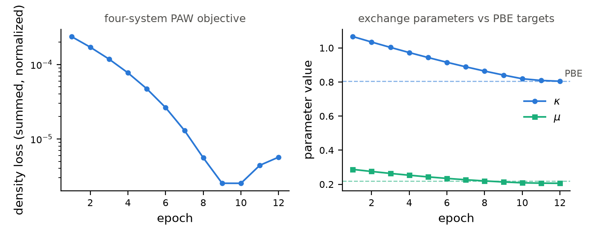

# Learning XC by automatic differentiation

The learnable functional is a PBE-form exchange enhancement with the shape of PBE
but trainable parameters. Initialized at the PBE values it reproduces PBE exactly.
At any positive $\kappa$ and $\mu$ it keeps the uniform-gas limit and the
Lieb-Oxford bound, so a partly trained functional is still a valid
generalized-gradient approximation.

The training run recovers PBE from a perturbed start.

| | $\kappa$ | $\mu$ | |
|---|---|---|---|
| **Start** | 1.100 | 0.300 | perturbed |
| **Recovered** | 0.804 | 0.2195 | PBE, through the SCF response |

## Theory

A generalized-gradient exchange energy is the local-density exchange scaled by an
enhancement factor,

$$ E_x[\rho] = \int \varepsilon_x^\text{LDA}(\rho)\, F_x(s)\, \rho\, \mathrm{d}^3 r, \qquad s = \frac{|\nabla \rho|}{2 k_F \rho}, \quad k_F = (3\pi^2 \rho)^{1/3}, $$

where $s$ is the reduced density gradient. The PBE enhancement
factor[[10]](bibliography.md#pbe) carries two parameters $\kappa$ and $\mu$,

$$ F_x(s) = 1 + \kappa - \frac{\kappa}{1 + \mu s^2 / \kappa}. $$

The uniform-gas limit $F_x(0) = 1$ and the Lieb-Oxford
bound[[11]](bibliography.md#lo) $F_x < 1 + \kappa$ hold for any positive $\kappa$,
$\mu$. gradwave makes $(\kappa, \mu)$ the learnable parameters $\theta$,
correlation stays fixed at PW92[[12]](bibliography.md#pw92) plus the PBE gradient
correction, and the parameters are stored through a softplus so they remain
positive under unconstrained training. At the PBE values $\kappa = 0.804$,
$\mu = 0.2195$ the functional is PBE.

## Two gradient regimes

Which backward you need depends on what the loss touches.[[13]](bibliography.md#kasim)

### Energy loss

The Kohn-Sham energy is stationary in the density at self-consistency, the same
property used for the forces. The total-energy derivative with respect to the
functional parameters is then the explicit partial derivative at fixed density,

$$ \frac{\mathrm{d}E}{\mathrm{d}\theta} = \left. \frac{\partial E_\text{xc}}{\partial \theta} \right|_{\rho}. $$

One call to `energy_param_grads` evaluates this. No response solve is needed.

### Density loss

A loss that reads the density itself, for example matching a reference density,
moves the density with $\theta$, so it needs the SCF response. The converged
density is a fixed point of the SCF map $G$,

$$ \rho^\star = G(\rho^\star, \theta). $$

By the implicit function theorem the response is a linear solve against the
Jacobian of the map,

$$ \frac{\mathrm{d}\rho^\star}{\mathrm{d}\theta} = \left( I - \frac{\partial G}{\partial \rho} \right)^{-1} \frac{\partial G}{\partial \theta}. $$

For a scalar loss $L(\rho^\star)$ the gradient never forms this explicitly. It
solves one adjoint linear system for $w$ and contracts,

$$ \left( I - \frac{\partial G}{\partial \rho} \right)^{\!\top} w = \frac{\partial L}{\partial \rho}, \qquad \frac{\mathrm{d}L}{\mathrm{d}\theta} = w^{\!\top} \frac{\partial G}{\partial \theta}. $$

The linear solve applies the density-response operator through conduction-projected
Sternheimer equations, the density functional perturbation theory kernel of Baroni
et al.,[[14]](bibliography.md#dfpt) and it is accelerated by Anderson
mixing[[15]](bibliography.md#anderson) and Kerker
preconditioning.[[16]](bibliography.md#kerker) `uspp_density_loss_param_grads` runs
exactly one such solve per gradient. The norm-conserving analog lives in
`scf/implicit.py`.

## The free case, energy loss

```python
from gradwave.core.xc.learnable import LearnableX, energy_param_grads
from gradwave.scf.loop import scf

xc = LearnableX(kappa=1.10, mu=0.30)   # perturbed start
res = scf(system, xc, etol=1e-9, rhotol=1e-7)
grads = energy_param_grads(res, xc)    # {'raw_kappa': ..., 'raw_mu': ...}
```

`energy_param_grads` differentiates $E_\text{xc}$ at the frozen converged density.
The gradients come back keyed on the raw (pre-softplus) parameters, which is what
an optimizer steps on.

## The response case, density loss

This mirrors the training example. Run the SCF, define a pure differentiable loss
of the total density, and take one adjoint solve.

```python
from gradwave.postscf.uspp_implicit import uspp_density_loss_param_grads
from gradwave.scf.uspp import scf_uspp

res = scf_uspp(system, xc, etol=1e-11, rhotol=1e-9)

def loss_fn(rho):
    d = rho - rho_ref
    return (d * d).sum() / norm

loss, grads = uspp_density_loss_param_grads(res, xc, loss_fn, floor_tol=1e-4)
```

!!! note "Which path"
    `energy_param_grads` takes a norm-conserving `scf` result.
    `uspp_density_loss_param_grads` takes a USPP/PAW `scf_uspp` result. The
    norm-conserving density-loss analog lives in `scf/implicit.py`.

## Run the full example

`examples/train_xc_paw.py` trains across four systems that span the adjoint's
coverage.

| system | what it exercises |
|---|---|
| Si | a PAW insulator |
| Al | a smeared metal with the Fermi-surface occupation response |
| Si, U = 4 | the +U occupation response on the 3p manifold |
| O₂ triplet | spin-polarized, in a vacuum box |

Target densities are generated at the PBE values of $(\kappa, \mu)$. Training
starts from the perturbed point $(1.10, 0.30)$ and must recover PBE
$(0.804, 0.2195)$ through the full self-consistent response. Every gradient is one
adjoint solve.

    uv run python examples/train_xc_paw.py 20

The run writes `examples/train_xc_paw.json` with the per-epoch loss and the
recovered $(\kappa, \mu)$. The loss is a relative density MSE, the optimizer is
Adam with backtracking that halves the rate when the loss rises, and a warm-start
chain reuses each system's converged density across epochs.



The summed density loss falls by about two orders of magnitude, and both exchange
parameters converge onto their PBE values (dashed) through the self-consistent
response.

## Adjoint knobs

`uspp_density_loss_param_grads` takes the solver controls as keywords.

| keyword | meaning |
|---|---|
| `beta` | Anderson mixing factor for the outer solve |
| `history` | Anderson depth |
| `outer_tol`, `max_outer` | outer response convergence and cap |
| `cg_tol`, `cg_max_iter` | inner Sternheimer CG controls |
| `floor_tol` | accept a stagnation floor below this and use the best iterate |
| `kerker_q0` | Kerker preconditioning of the outer residual, q0 in Å⁻¹ |

!!! warning "Vacuum systems"
    `floor_tol` and `kerker_q0` exist for vacuum cells. O₂ in a box has an
    achievable outer floor that wanders with the functional parameters. The Kerker
    factor $q^2 / (q^2 + q_0^2)$ damps the long-wavelength vacuum noise that set the
    old stagnation floor. Setting `kerker_q0=1.5` measured a drop from a floored
    1.4e-4 to a converged 1.4e-5. `floor_tol` stays as the safety net for parameter
    points where the floor wanders back up. Leave both unset for validation work,
    where the strict behavior is what you want.

## Gotchas

- Train `raw_kappa` and `raw_mu`, the softplus pre-images. Read the physical
  $\kappa$ and $\mu$ through the `.kappa` and `.mu` properties. Gradients are keyed
  on the raw parameters.
- Degenerate occupied subspaces need the full block projected out of the
  Sternheimer solve, or the conduction projector is ill-defined and CG stalls. The
  Si valence top is three-fold at Γ. This is handled internally, but it is why
  individual degenerate eigenvectors are never differentiated.
- Metals need the smearing to match between the forward SCF and the target so the
  Fermi-surface response is consistent.
- For nspin=2 the loss stays a functional of the total density, so its gradient
  seeds both spin channels equally.

## Next

Continue to [Symmetry reduction](symmetry.md).
