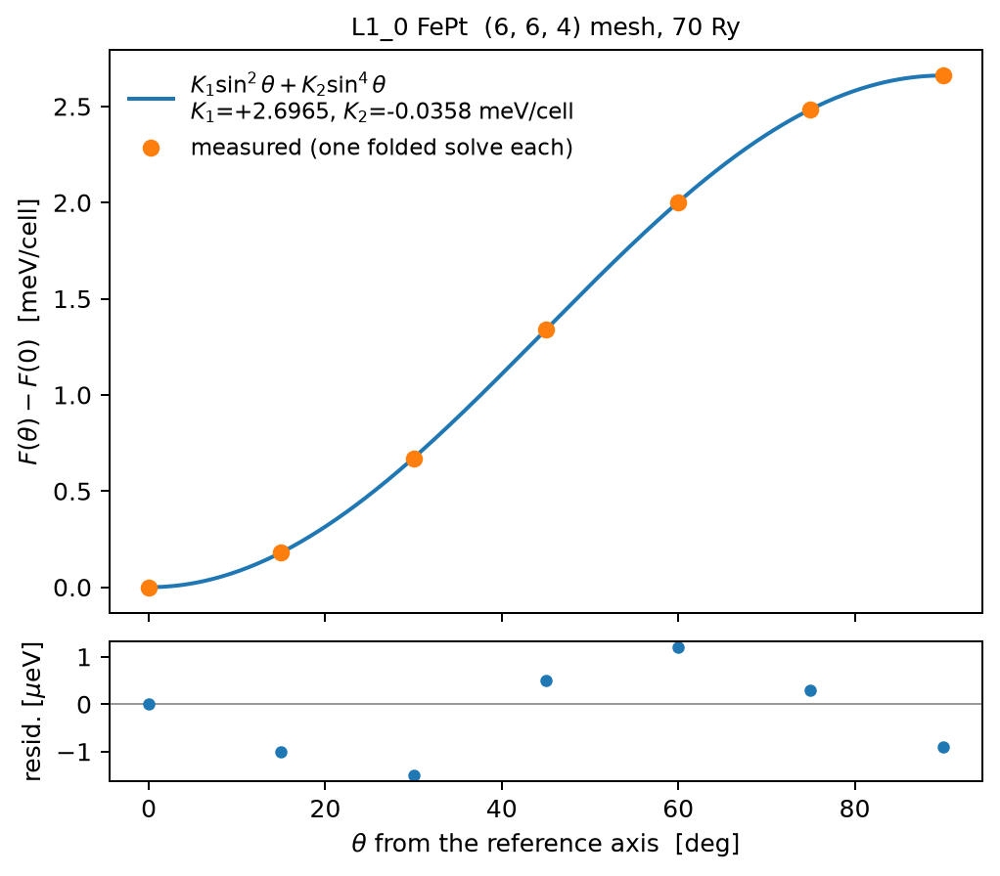

# Magnetocrystalline anisotropy

With spin-orbit coupling the total energy depends on the direction of the
magnetization relative to the lattice. The difference between directions is
the magnetocrystalline anisotropy energy (MAE) — meV-per-cell physics that
decides easy axes, coercivity, and whether a material is any good as a
permanent magnet. This tutorial walks the FePt L1₀ case from one SCF to a
fitted $E(\theta)$ curve and a plot. The compact reference for the same
machinery lives in
[Magnetic structure and spin Hamiltonians](magnetism.md#magnetocrystalline-anisotropy).

Everything here needs fully-relativistic pseudopotentials (the anisotropy
enters through the SOC projectors) and the spinor SCF: `scf_noncollinear` on
a system built from FR UPFs.

## Two routes to one number

The direct route converges one full SOC SCF per direction and subtracts.
`examples/fept_mae.py` runs it for FePt: at the converged $6\times6\times4$
mesh (70 Ry) it gives $E[100]-E[001] = +2.552$ meV/cell, easy axis along
$c$. It costs a full SCF per direction, and it carries a trap: the 48-point
mesh gives the *wrong* easy axis ($-1.39$ meV/cell). Never trust an
anisotropy sign from a coarse mesh.

The force theorem replaces every SCF after the first. Freeze the converged
$(\rho, \mathbf{m})$ of a reference direction, rotate the magnetization
rigidly, rebuild the frozen-potential Hamiltonian, diagonalize once, and
difference the occupied band free energies

$$
E(\hat n) - E(\hat n_{\mathrm{ref}}) \;\approx\; F_{\mathrm{band}}(\hat n) - F_{\mathrm{band}}(\hat n_{\mathrm{ref}}),
\qquad
F_{\mathrm{band}} = \sum_{k} w_k \sum_b f_{kb}\,\varepsilon_{kb} - \sigma S .
$$

The double-counting terms sit on identical frozen fields for every direction
and cancel exactly in the difference; the error is second order in the
density change. Measured on FePt at the shared mesh the two routes agree to
4%.

## One SCF, many directions

Converge the reference on the **full** k-mesh (`use_symmetry=False,
time_reversal=False` — a mesh folded by the reference direction's magnetic
group is an invalid quadrature for a rotated moment), then hand the result to
`force_theorem_mae`:

```python
from gradwave.postscf.mae import force_theorem_mae

res = scf_noncollinear(system, xc, mag_vec_init=init, ...)   # one SCF
ft = force_theorem_mae(res, xc,
                       directions=[[0, 0, 1], [1, 0, 0], [1, 1, 0]],
                       magmoms=init)      # per-direction magnetic-IBZ fold
ft.mae        # F_band(n) - F_band(ref) per direction [eV]
ft.nk         # k-points each direction actually used
```

Each direction is one Davidson solve seeded with the SU(2)-rotated reference
spinors, so it costs roughly one SCF iteration. `magmoms=` (the per-atom
moments the SCF was seeded with) folds each solve into that direction's own
magnetic Shubnikov IBZ over the same mesh — on FePt's $6\times6\times4$ mesh
$[001]$ keeps 30 of 144 points and a generic tilt keeps 56, and the folded
band sums match the full-mesh ones to $\sim 4\times10^{-12}$ eV
([Symmetry reduction](symmetry.md#magnetic-shubnikov-symmetry) has the group
theory). The first entry in `directions` is the reference for the returned
differences; keep it equal to the SCF axis so the force-theorem residual
cancels.

## A full E(θ) map

`examples/fept_mae_map.py` is the end-to-end version: one reference SCF
along $[001]$, seven folded solves tilting toward $[100]$, and a
least-squares fit of the uniaxial form
$K_1\sin^2\theta + K_2\sin^4\theta$. Measured result
(`benchmarks/fept_mae_map/`): $K_1 = +2.6965$ meV/cell,
$K_2 = -0.0358$ meV/cell, largest fit residual 1.5 μeV — FePt follows the
single-constant form to within a percent. The whole map costs about an hour
of CPU; each extra direction about two minutes.



The script writes two machine-readable files next to its stdout log:

- `fept_mae_map.json` — θ values, measured $\Delta F$, the fit, fold counts,
  timings, and provenance. Self-contained input for plotting.
- `fept_mae_map.pt` — the full `MAEResult` via `ft.save()`, including the
  per-direction eigenvalue spectra and Fermi levels. Reload with
  `MAEResult.load("fept_mae_map.pt")`; this is what makes later
  band-resolved analysis possible without repeating the SCF.

## Against the literature

Khan, Blaha, Ebert, Minár, and Šipr[[24]](bibliography.md#khan) is the
detailed reference study for exactly this system: two full-potential
all-electron methods (FLAPW and KKR) converge on an LDA MCA energy of
**3.0 meV/f.u.**, they fit the same angular form and get
$K_1 = 3.008$ meV with $K_2 = 0.092$ meV, and they survey earlier LDA
work spanning 1.8 to 4.3 meV. Three useful calibration points fall out:

- Our k-converged number sits on theirs. The 384-k magnetic-IBZ run
  (`examples/fept_mae.py` header) gives $+2.993$ meV/cell; the map above,
  at the cheaper $6\times6\times4$ mesh, gives $+2.66$ — the gap is
  k-convergence, and the easy axis and curve shape are stable across it.
- Experiment is $1.3$–$1.4$ meV/f.u. The factor-of-two LDA overestimate is
  a functional error shared by every LDA code, so the correct target for
  verifying the *implementation* is agreement with other LDA results;
  closing the gap to experiment requires going beyond the functional.
- Their force-theorem values differ from their total-energy differences by
  up to $\sim 0.3$ meV across codes (2.85–3.12), the same few-percent
  band our 4.2% force-theorem-vs-self-consistent agreement lands in. Their
  $K_2/K_1 \approx +3\%$ against our $-1.3\%$ shows the sin⁴ term is small
  and method-sensitive; the sin² term carries the physics in both.

## Plotting

matplotlib stays out of the package dependencies; install it where needed
(`uv pip install matplotlib`). The committed script draws the curve, the fit
on a dense θ grid, and a residual strip:

```bash
uv run python scripts/plot_mae.py fept_mae_map.json -o mae_map.png
```

The minimal inline version:

```python
import json, numpy as np, matplotlib.pyplot as plt

d = json.load(open("fept_mae_map.json"))
th = np.deg2rad(d["theta_deg"])
s2 = np.sin(np.linspace(0, th.max(), 200)) ** 2
plt.plot(np.degrees(np.linspace(0, th.max(), 200)),
         d["K1_meV"] * s2 + d["K2_meV"] * s2**2, "-", label="fit")
plt.plot(d["theta_deg"], d["dF_meV"], "o", label="measured")
plt.xlabel(r"$\theta$ [deg]"); plt.ylabel(r"$\Delta F$ [meV/cell]")
plt.legend(); plt.savefig("mae_map.png", dpi=180)
```

## Gotchas

- **Converge the k-mesh before believing the sign.** The FePt 48-point mesh
  flips the easy axis. The force-theorem and self-consistent routes share
  whatever mesh you give them, so mutual agreement never certifies
  k-convergence.
- **The reference SCF needs the full mesh.** Only the per-direction
  evaluations fold; `force_theorem_mae` raises if the reference system
  carries a symmetrizer.
- **Match the smearing.** Pass the same `smearing`/`width` the reference SCF
  used; each direction refits its own Fermi level at fixed electron count.
- **Scalar-relativistic pseudos give exactly zero anisotropy.** Without SOC
  projectors the band sum is rotation invariant — a useful null test of the
  pipeline (`tests/integration/test_mae_force_theorem.py`), and a warning
  sign if you expected a finite MAE.
