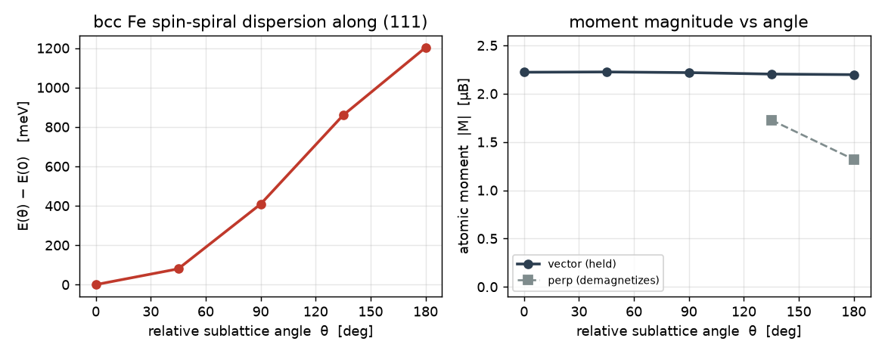

# Magnetic structure and spin Hamiltonians

The spinor SCF of [Non-collinear magnetism and SOC](noncollinear-soc.md) gives the
charge and magnetization at a fixed moment configuration. This page reads magnetic
structure out of it. The ground-state moment directions come from constrained
density-functional theory, the exchange constants from the constraint torque, and a
single input task rolls both into a Heisenberg model with a mean-field Curie
temperature.

## Optimizing the magnetic configuration

The moment *directions* are themselves degrees of freedom, and gradwave finds the
ground-state configuration by constrained density-functional theory. Each atomic
moment is held toward a target direction $\hat{\mathbf{e}}_I$ by a penalty field,
and the torque that would rotate the *unconstrained* moment is read off and
descended.

Following Ma and Dudarev,[[23]](bibliography.md#madudarev) an atomic moment $\mathbf{M}_I = \int
w_I(\mathbf{r})\,\mathbf{m}(\mathbf{r})\,\mathrm{d}^3r$, with a Hirshfeld weight
$w_I$ localizing on atom $I$, is pinned to $\hat{\mathbf{e}}_I$ by adding a
penalty $E_p = \sum_I \lambda\,|\mathbf{M}_I^\perp|^2$ to the energy, which
contributes a constraining field $\mathbf{B}_c = 2\lambda \sum_I w_I\,
\mathbf{M}_I^\perp$ to the spinor Hamiltonian. The gradient of the constrained
functional $W = E_\text{KS} + E_p$ with respect to a target direction is

$$ \frac{\partial W}{\partial \hat{\mathbf{e}}_I} = -2\lambda\,(\mathbf{M}_I \cdot \hat{\mathbf{e}}_I)\,\mathbf{M}_I^\perp, $$

which gradwave validates against a finite difference of $W$ (they agree to a ratio
of 1.000). A configuration is a stationary point of the true energy when no
constraint is needed, $\mathbf{M}_I^\perp \to 0$.

```python
from gradwave.postscf.moment_config import relax_moment_directions

# two O moments started 45° apart, in the x-z plane
dirs0 = [[0.0, 0.0, 1.0], [0.707, 0.0, 0.707]]
final, history = relax_moment_directions(
    system, NoncollinearXC(LSDA_PW92()), dirs0,
    lam=2.0, step=0.5, smearing="gaussian", width=0.1)
```

Each sweep runs a constrained SCF, reads the torque, and rotates the targets
downhill. For triplet O₂, a ferromagnet, two moments started 45° apart collapse
to parallel in three sweeps and the energy falls to the unconstrained
ground-state value.

| sweep | relative angle | energy (eV) |
|---|---|---|
| start | 45.0° | −840.675 |
| 1 | 4.6° | −840.823 |
| 2 | 0.3° | −840.825 |

`constrained_moment_scf` runs a single constrained point, returning the atomic
moments, the constraining field, and the torque. `relax_moment_directions`
wraps the descent. With a fully-relativistic pseudopotential the same machinery
gives the magnetocrystalline-anisotropy torque, since spin-orbit coupling ties
the moment to the lattice.

## The magnitude problem, and holding a moment at any angle

The $|\mathbf{M}^\perp|^2$ penalty constrains only the moment *direction*, and it
is minimized ($E_p \to 0$) at $\mathbf{M}=0$. So a strongly-coupled magnet forced
to a large relative angle demagnetizes rather than holding its moments apart, a
low-energy way to satisfy the constraint. Demagnetizing is a genuine physical route out of frustration,
not a solver artifact. The consequence is that `mode="perp"` cannot represent a
metastable antiferromagnetic state.

The `mode="vector"` penalty pins the full moment vector,
$E_p = \sum_I \lambda\,|\mathbf{M}_I - m^0_I\,\hat{\mathbf{e}}_I|^2$, so
demagnetizing now costs $\lambda\,(m^0_I)^2$. The target magnitude $m^0_I$ defaults
to the unconstrained self-consistent $|\mathbf{M}_I|$ (measured once by
`reference_moment_magnitudes`). Forcing the two O moments of O₂ *antiparallel*
shows the difference sharply.

```python
m0 = reference_moment_magnitudes(system, xc, [[0, 0, 1], [0, 0, 1]], weights=w)
afm = [[0, 0, 1], [0, 0, -1]]                       # target: antiparallel
_, perp = constrained_moment_scf(system, xc, afm, lam=8.0, weights=w, mode="perp")
_, vec  = constrained_moment_scf(system, xc, afm, lam=8.0, weights=w,
                                 mode="vector", target_mag=m0)
```

| mode | $\lvert\mathbf{M}_I\rvert$ (μB) | $M_z$ (μB) | outcome |
|---|---|---|---|
| `perp`   | 0.00, 0.00 | 0.00, 0.00 | demagnetized, constraint met at no energy cost |
| `vector` | 0.81, 0.81 | +0.81, −0.81 | genuine antiferromagnet, held |

The held antiferromagnetic state lies ≈3.0 eV above the ferromagnetic ground
state, which is O₂'s exchange splitting, a number `perp` cannot produce because it
never holds the moments. The field, the torque, and both penalty forms are one
differentiable definition (`gradwave.scf.moment_penalty`), so the SCF field and
the config-search gradient stay consistent by construction, and the gradient
matches a finite difference of $W$ to a part in $10^3$.

!!! note "Penalty stiffness vs. convergence"
    `vector` holds *magnitude* robustly, but a finite $\lambda$ is a soft
    constraint. It trades the target *angle* against the exchange energy, and the
    constrained SCF for a strongly-frustrated forced angle can settle into a small
    residual plateau rather than converging tightly. Raise $\lambda$ to hold the
    angle stiffer. A natural collinear axis (parallel or antiparallel) converges
    far more easily than an oblique one.

## Spin-spiral dispersion of bcc Fe

The magnitude-robust constraint is what a frozen spin spiral requires, holding
every atomic moment at full magnitude while rotating its direction. `gradwave` has
no generalized-Bloch machinery, but a *commensurate* spiral needs none. A two-atom
bcc cell (corner and body-center sublattices) with the body-center moment rotated by
$\theta$ relative to the corner is a spiral of pitch $\theta$ per (111) step. Sweeping
$\theta$ with `mode="vector"` traces the adiabatic ("frozen-magnon") dispersion
$E(\theta)$ at fixed moment (`examples/fe_spin_spiral.py`, run on CPU).

| $\theta$ | $E(\theta)-E(0)$ | $\lvert\mathbf{M}\rvert$ (vector) | $\lvert\mathbf{M}\rvert$ (perp) |
|---|---|---|---|
| 0°   | 0 meV      | 2.222 μB | — |
| 45°  | +80 meV    | 2.225 μB | — |
| 90°  | +409 meV   | 2.218 μB | — |
| 135° | +859 meV   | 2.203 μB | 1.73 μB |
| 180° | +1203 meV  | 2.197 μB | 1.32 μB |



$E(\theta)$ rises monotonically from the ferromagnetic ground state ($\theta=0$) to the
antiparallel state, and the `vector` moment holds ~2.2 μB across the whole spiral. The
`perp` penalty behaves differently at the two ends of the sweep. At the *collinear*
endpoints it is fine ($\theta=180°$ relaxes to the true bcc-Fe antiferromagnet, 1.32 μB,
a smaller moment than the ferromagnet, which is correct Fe physics), but at the
*non-collinear* $\theta=135°$ it demagnetizes to 1.73 μB because shrinking the moment is
the cheap way to satisfy $|\mathbf{M}^\perp|^2$. Only the magnitude-robust penalty traces
the fixed-moment dispersion the whole way around.

## One-call characterization with `task: magnetism`

The routines above are also exposed as a single input task.
`characterize_magnetism` runs a non-collinear reference SCF for the atomic moments,
extracts the Heisenberg exchange from the torque, and reports the ordering, moments,
J, DMI, and a mean-field Curie temperature. From YAML
(`examples/input_o2_magnetism.yaml`):

```yaml
task: magnetism
magnetism:
  exchange: true          # extract J from the torque (~3 constrained SCFs)
  lam: 8.0
scf: {mixing: {alpha: 0.4}}   # conservative, the NC SCF is multi-stable
```

writes `magnetism.json` and a formatted `magnetism.out`:

```
── magnetism ───────────────────────────────
   ordering: ferromagnetic
   total moment: 1.999 μB
   atomic moments [μB]: 1.000, 1.000
   Heisenberg exchange [meV]: J_1 = +1434.0
```

Set `exchange: false` for a cheap moments-and-ordering pass. Or call the routine
directly and inspect the `MagneticReport`:

```python
from gradwave.postscf.magnetism import characterize_magnetism
report = characterize_magnetism(system, xc, exchange=True)
print(report.summary())
```

The exchange tensor is the site-to-site derivative of the autograd torque,
$\mathcal{J}_{IJ} = \partial T_I/\partial\hat{\mathbf{e}}_J$. Tilting one moment and
reading the induced torque on the others is one finite-difference order, not the two
of energy mapping, so it is lower-noise. bcc Fe gives $J_1 \approx 22$ meV (LKAG
reports 15 to 19), DMI zero by centrosymmetry, and a mean-field $T_c$ of 1388 K
matching Pajda's mean-field value. The DMI and single-ion anisotropy channels are
reported as ~0 without spin-orbit coupling, as symmetry requires. They become
nonzero once a fully-relativistic magnetic pseudopotential is supplied. See the
anisotropy notes in `docs/ideas.md`.

## Magnetocrystalline anisotropy

With fully-relativistic pseudopotentials the total energy depends on the
magnetization direction, and the difference is the magnetocrystalline
anisotropy energy (MAE). Two routes are available.

**Self-consistent differences.** Converge one full SOC SCF per direction and
subtract. `examples/fept_mae.py` runs L1_0 FePt this way: at the converged
$6\times6\times4$ mesh (70 Ry, LSDA), $\mathrm{MAE} = E[100] - E[001] =
+2.552$ meV/cell, easy axis along $c$, within the 1.8 to 4.3 meV/f.u. band
of published LDA values; the converged full-potential LDA reference is
3.0 meV/f.u. against a 1.3 to 1.4 meV experiment.[[24]](bibliography.md#khan)
Each orientation folds by its own magnetic group
([Magnetic symmetry](symmetry.md#magnetic-shubnikov-symmetry)) as long as both
share the underlying mesh. The 48-point mesh gives the *wrong* easy axis
($-1.39$ meV/cell), the textbook k-convergence trap. Never trust an anisotropy
sign from a coarse mesh. `tests/integration/test_fept_mae.py` gates this
result.

**The magnetic force theorem.** `postscf.mae.force_theorem_mae` replaces all
but the first SCF. It freezes the converged $(\rho, \mathbf{m})$ of a
reference direction, and for each requested direction rotates the
magnetization rigidly, rebuilds the frozen-potential spinor Hamiltonian, and
diagonalizes once. To second order in the density change the band-energy
difference equals the total-energy difference, because the double-counting
terms are evaluated on the same frozen fields and cancel exactly.

```python
from gradwave.postscf.mae import force_theorem_mae

res = scf_noncollinear(system, xc, mag_vec_init=..., ...)  # one SCF, full mesh
ft = force_theorem_mae(res, xc, [[0, 0, 1], [1, 0, 0], [1, 1, 0]])
ft.mae          # F_band(n) − F_band(ref) per direction [eV]
```

The rotation is exact for the potential (the locally-collinear $B_{xc}$
co-rotates with $\mathbf{m}$ and $v_{xc}$ is unchanged), and the anisotropy
enters only through the lattice-fixed SOC projectors. Each one-shot solve is
seeded with the SU(2)-rotated reference spinors, so it costs roughly one SCF
iteration per direction. This is the route to full $E(\theta, \phi)$ maps
rather than two-point differences. The reference must be converged on the full
mesh (`use_symmetry=False, time_reversal=False`). A mesh folded by the
reference magnetic group is not a valid quadrature for a rotated moment.

**Per-direction magnetic-IBZ folding.** Passing `magmoms=` (the per-atom
moments of the reference texture, the same list the SCF was seeded with)
folds each one-shot solve into its *own* direction's magnetic Shubnikov IBZ:
the moments are rotated with the direction, the magnetic group of the rotated
texture folds the mesh, and the solve runs on the surviving subset of the
stored k-points with the folded weights. On the FePt $6\times6\times4$ mesh
$[001]$ keeps 30 of 144 points, $[100]$ keeps 48 and a generic $(010)$-plane
tilt keeps 56, so this compounds with the force-theorem saving. The fold is
exact for the collinear part of the frozen magnetization (measured residual
$\sim 4\times10^{-12}$ eV against the full-mesh sums). The reference SCF
still needs the full mesh. Only the evaluations fold.
`examples/fept_mae_map.py` uses this to scan $E(\theta)$ from $[001]$ to
$[100]$ and fit $K_1\sin^2\theta + K_2\sin^4\theta$. Measured on the
$6\times6\times4$ mesh: $K_1 = +2.697$ meV/cell, $K_2 = -0.036$ meV/cell
with a fit residual below $0.002$ meV, each folded direction costing about
2 minutes of CPU on top of the one reference SCF.

**Saving results.** `ft.save("mae.pt", meta={...})` archives the full
`MAEResult` — band free energies, per-direction Fermi levels, fold counts and
the complete eigenvalue spectra — and `MAEResult.load("mae.pt")` restores it,
so band-resolved analysis never requires repeating the reference SCF. The map
example additionally writes a plotting-ready `fept_mae_map.json` with the
measured curve, the $K_1$/$K_2$ fit and the run provenance.

Validation: without SOC the band sum is direction-independent to below
$10^{-6}$ eV (the rotation is then an exact symmetry), and the reference
direction reproduces the converged SCF spectrum
(`tests/integration/test_mae_force_theorem.py`). On FePt at the converged
mesh (`examples/fept_mae_force_theorem.py`) the force-theorem MAE is
$+2.673$ meV/cell against the self-consistent $+2.552$ (4.7%), each extra
direction costs about an eighth of a full SCF, and the $45°$-tilted direction
lands at half the $[100]$ value — the uniaxial $\sin^2\theta$ form measured
directly.

## Gotchas

- The direction-only penalty (`mode="perp"`) has a magnitude loophole and
  demagnetizes at oblique forced angles. Use `mode="vector"` for anything off a
  collinear axis, and pass `target_mag` from `reference_moment_magnitudes`.
- Seed non-collinear references high-spin. The bare unconstrained non-collinear SCF
  is multi-stable, and a weak moment seed collapses O₂ or Fe to a low-spin or
  nonmagnetic solution. Seed above saturation (`mag_init_scale` ~1.5) and let it
  relax down, or pass the target magnitude explicitly.
- A constrained calculation at a strongly-frustrated oblique angle can limit-cycle at a
  small residual rather than converge tightly, though the moment values stay stable.
  Raise $\lambda$, and prefer a collinear axis where the physics allows it.
- A small cell folds periodic images, so the extracted $J$ is the shell-summed
  $J(q=0)$, a slight overcount. Per-shell $J_n$ needs a supercell or the
  reciprocal-space $J(q)$ route.

## Next

See the [Reference](reference.md) page for the CLI, output files, and entry points.
