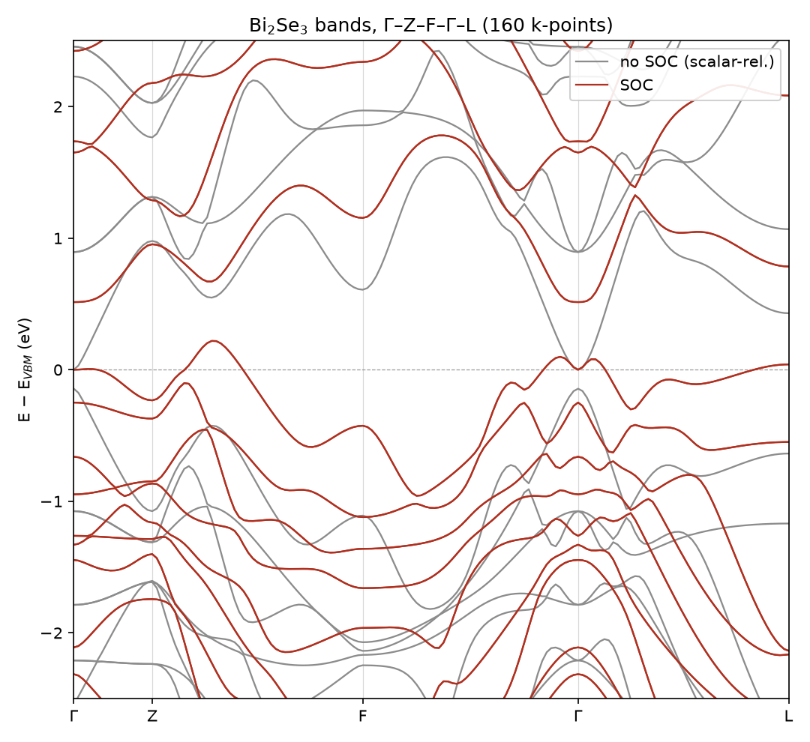
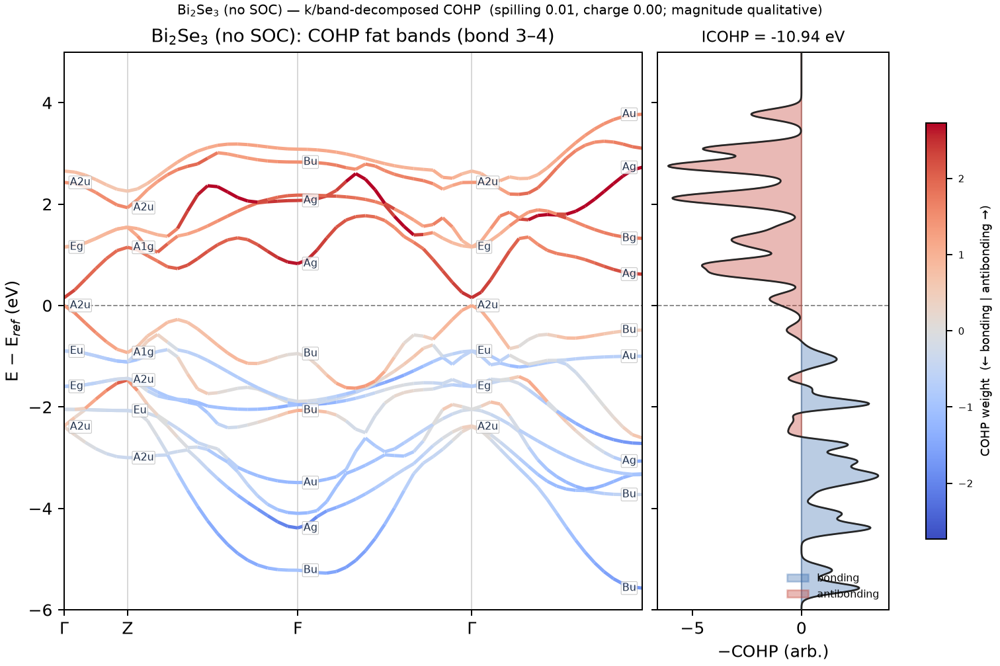
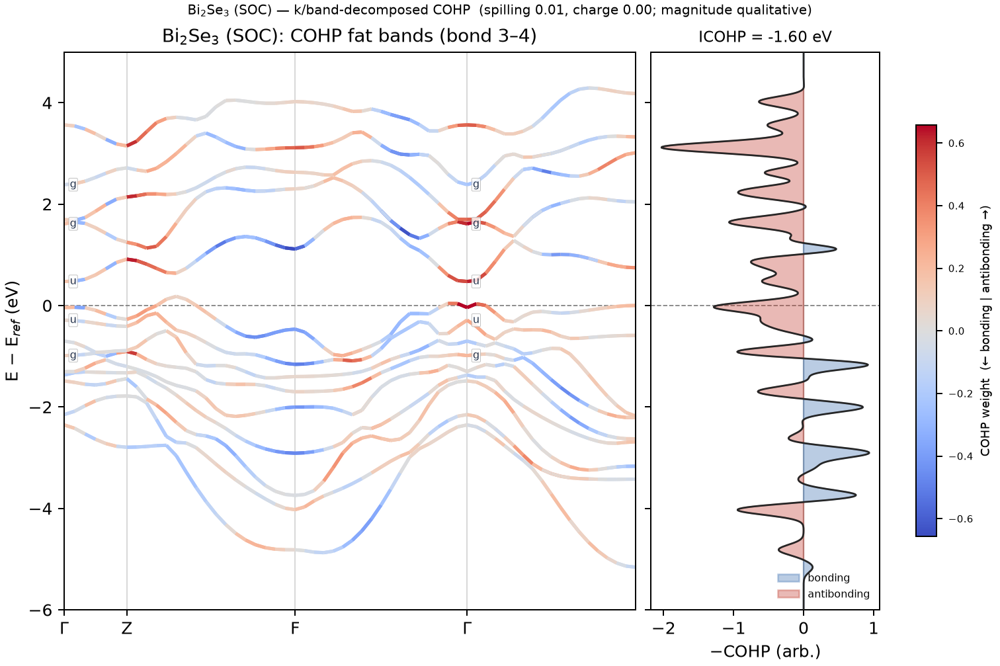

# Non-collinear magnetism and spin-orbit coupling

gradwave solves the two-component (spinor) Kohn-Sham problem, so magnetic moments
can point in any direction and spin-orbit coupling (SOC) can mix them. A topological
band inversion demonstrates both. In Bi₂Se₃ spin-orbit coupling swaps the parity of
the states across the gap at Γ, the fingerprint of a topological insulator.

This page covers the spinor SCF, SOC from a fully-relativistic pseudopotential, and
collinear spin as the cheaper special case. To extract magnetic structure, the
ground-state moment configuration, exchange constants, and spin Hamiltonians, see
[Magnetic structure and spin Hamiltonians](magnetism.md).

## Theory

A non-collinear wavefunction is a two-component spinor, and gradwave stores it as a
doubled plane-wave vector, the spin-up block followed by spin-down. The density
becomes a scalar charge plus a vector magnetization through the Pauli decomposition,

$$ \rho = \psi^\dagger \psi, \qquad \mathbf{m} = \psi^\dagger \boldsymbol\sigma\, \psi, $$

and the potential gains a magnetic part, $\hat V = (v_H + v_\text{loc} + v_\text{xc})\,
\mathbb{1} + \mathbf{B}_\text{xc}\cdot\boldsymbol\sigma$, with $\mathbf{B}_\text{xc}$
from autograd of the non-collinear functional. The charge and the three
magnetization fields are mixed jointly, with Kerker preconditioning on the charge
channel only.

**Spin-orbit coupling** comes from a fully-relativistic pseudopotential, whose
projectors are resolved by total angular momentum $j = l \pm \tfrac12$. gradwave
builds these $j$-resolved spinor projectors from complex spherical harmonics and
Clebsch-Gordan coefficients[[21]](bibliography.md#dalcorso) and adds them as a genuine $2\times2$ block in
the non-local Hamiltonian. Because spin-orbit coupling breaks the separate spin
and spatial rotation symmetries, time-reversal k-reduction is kept only through
Kramers degeneracy for a nonmagnetic cell. A net moment breaks time reversal as
a standalone symmetry, but the mesh does not fall back to the full Brillouin
zone: passing `magmoms=` at setup folds k by the magnetic (Shubnikov) group of
the moment configuration instead — see
[Magnetic symmetry](symmetry.md#magnetic-shubnikov-symmetry).

## The non-collinear SCF

`scf_noncollinear` takes an initial per-atom moment direction and magnitude and
converges the spinor density.

```python
from gradwave.scf.noncollinear import scf_noncollinear
from gradwave.core.xc.noncollinear import NoncollinearXC
from gradwave.core.xc.spin import LSDA_PW92

res = scf_noncollinear(
    system, NoncollinearXC(LSDA_PW92()),   # wrap any collinear SpinXC
    mag_vec_init=[[0.0, 0.0, 0.4]],   # (na, 3): direction · fraction per atom
    smearing="gaussian", width=0.1,
)
res.mag_vec     # ∫ m⃗ dr, the net moment vector
res.mag_abs     # ∫ |m⃗| dr
res.m           # (3, grid) magnetization field
```

For a nonmagnetic system where only the spin-orbit splitting matters, pin the
moment to zero with `nonmagnetic=True` (QE's `domag=false`). The spinor structure
and SOC stay, the magnetization does not. The converged moment *direction* is
whatever the unconstrained SCF settles into.

### Convergence and the magnetic knobs

A magnetic spinor SCF does not reach the norm-conserving `rhotol` default on a
metallic magnet. The magnetization-channel residual floors near 2e-3 from a
transverse instability while the fixed point underneath is converged. Across
mixer arms fcc Ni + SOC agrees on the free energy to 4e-5 eV and on the moment to
four digits, so the residual gate reports an error the energy does not have.
Gate on the energy instead of loosening the residual tolerance by hand.
`scf.convergence: energy` stops the spinor run when the residual's exact
second-order energy error falls below `scf.entol`, with the per-channel charge,
longitudinal, and transverse decomposition recorded in the trace. A magnetic
spinor run wants `entol` 1e-4, not the collinear-calibrated 1e-6 default. See
[Improving convergence](convergence.md#the-spinor-path) for the measured floors.

The (ρ, m⃗) mixing is controlled under `scf.magnetic`, which the spinor driver
resolves independently of `scf.mixing` (it never reads `scf.mixing.scheme`).
`mixer` selects the mixer class (`pulay`, `johnson`, or `broyden`),
`spin_precond` turns on the Stoner preconditioner for the longitudinal moment
channel, `mixing_alpha` sets the moment step, and `diago_schedule` picks the
adaptive diagonalization-tolerance schedule (`linear` or `quadratic`). On fcc
Ni + SOC the stock `pulay` default holds the moment, and the lowest measured
floor comes from `johnson` with the `quadratic` schedule and a moment step of
0.3, the moment held throughout.

This exact configuration stops fcc Ni + SOC at iteration 10 with the free
energy at the campaign's cross-arm consensus and the moment at 0.674 $\mu_B$,
where the stock configuration exhausts an 80-iteration budget without firing.

```yaml
scf:
  convergence: energy
  entol: 1.0e-4
  magnetic:
    mixer: johnson
    diago_schedule: quadratic
    mixing_alpha: 0.3
```

`johnson` normalizes its update, so the `pulay`-tuned moment-step boost
(`max(alpha, 0.6)`) inverts into a moment-collapse accelerant. On the SOC-free
spinor run of the same Ni cell the boosted step drives the moment through zero by
iteration 5 and converges onto the nonmagnetic branch, 1.2 meV above the
ferromagnetic answer. When `mixer: johnson` is selected without an explicit
`mixing_alpha`, the driver takes 0.3 rather than the pulay guard for that reason.

## Spin-orbit band inversion in Bi₂Se₃

`examples/bi2se3_inversion.py` runs the calculation twice, a scalar-relativistic
`scf` and a fully-relativistic `scf_noncollinear(..., nonmagnetic=True)`, and
labels the parity of the Γ states around the gap. Without SOC the ordering is the
normal-insulator one. With SOC the conduction and valence parities **swap**, the
$Z_2$-nontrivial signature of the topological surface states.[[22]](bibliography.md#bi2se3)



The scalar-relativistic and fully-relativistic bands are overlaid on the same path.
Spin-orbit coupling opens and inverts the gap at Γ, and the valence-band maximum
moves off Γ into a camelback.

### COHP fat bands, with and without SOC

`examples/bi2se3_cohp_fatbands.py` draws the same [LOBSTER-style COHP fat-band
figure](postscf-analysis.md#crystal-orbital-hamilton-populations-cohp) used for
diamond and GaAs, but for both Bi₂Se₃ branches — so the Bi-Se bonding character
of the inverted states is visible alongside the parity labels at Γ. The no-SOC
branch projects onto the operator-route collinear COHP; the SOC branch keeps
the eigenvectors from a per-path-k spinor solve and feeds them through the
eigenvalue-route spinor COHP (`cohp_soc`), so the fat-band weights are
genuinely k-dependent spin-orbit COHP, not a Γ-only slice.

```bash
uv run python examples/bi2se3_cohp_fatbands.py --outdir examples
```

<figure markdown>
  { width="720" }
  <figcaption>Without spin-orbit coupling: the Bi-Se bond along Γ-Z-F-Γ, each
  (k, band) colored by its COHP weight (bonding blue, antibonding red), with
  Mulliken irrep + g/u parity labels at the special points. ICOHP = −10.94 eV.</figcaption>
</figure>

<figure markdown>
  { width="720" }
  <figcaption>With spin-orbit coupling: the same bond, same path, spinor COHP.
  The Γ-point parities near the gap swap relative to the no-SOC case (the same
  inversion `bi2se3_inversion.py` reports), and the bonding/antibonding
  character reorganizes around it. ICOHP = −1.60 eV — spin-orbit coupling
  redistributes the bonding weight rather than simply weakening it; read the
  magnitude qualitatively (see the COHP page's calibration note) and the sign/
  shape quantitatively.</figcaption>
</figure>

The SOC machinery is validated quantitatively on the GaAs valence split-off. The
$\Gamma_8$ (four-fold) lies above $\Gamma_7$ (two-fold) with a spin-orbit gap
$\Delta_0 = 0.336$ eV against QE's fully-relativistic reference (experiment 0.34 eV),
agreeing to $2\times10^{-3}$ eV. Spin-orbit character is also resolvable in the
projected density of states, separating a shell into its $j$ channels (a
$6P_{1/2}$ from a $6P_{3/2}$, for instance).

## Collinear spin, with numbers

When the moments are collinear a full spinor solve is unnecessary. Set `nspin=2`
and an initial moment fraction, and read the converged moment off the result.

```python
res = scf(system, SpinPBE(), nspin=2, start_mag=[0.4],   # bcc Fe
          smearing="gaussian", width=0.1)
res.mag_total    # ∫ (ρ↑ − ρ↓) dr [μB]
```

This path is QE-validated. bcc Fe converges within 0.02 $\mu_B$ of QE's moment and
under 1 meV/atom, and the triplet O₂ molecule reproduces the $m = 2\,\mu_B$ moment to
$10^{-3}$. The USPP/PAW spin path (`scf_uspp`, `nspin=2`) carries the same
`start_mag` and `mag_total`. The default mixing scheme resolves to `johnson` for
`nspin=2`, the more robust choice for the stiff spin-channel response.

The post-SCF properties run for the collinear path as well, the forces, stress,
bands, KPM density of states, ELF, and the dielectric response, alongside a
fixed-spin-moment mode and the antiferromagnetic k-fold. See
[Collinear spin-polarized calculations](magnetism.md#collinear-spin-polarized-calculations-nspin2).

## Gotchas

- A fully-relativistic pseudopotential is required for SOC, and the collinear `scf`
  rejects one. PseudoDojo fully-relativistic sets work, though their NLCC is
  unsupported on the spin-orbit path. SG15 fully-relativistic works.
- A magnetic non-collinear calculation uses the full mesh by default, because a
  net moment lowers the crystal symmetry. It does not have to: pass `magmoms=` to
  `setup_system`/`setup_uspp` and the k-mesh folds by the magnetic (Shubnikov)
  group instead (L1_0 FePt, m ∥ [001]: 144 → 30 k), exact against the full mesh
  to $5\times10^{-11}$ eV. See
  [Magnetic symmetry](symmetry.md#magnetic-shubnikov-symmetry). A nonmagnetic
  SOC calculation keeps time-reversal (Kramers) reduction automatically.
- The $\pm\mathbf{m}$ branches are exactly degenerate without spin-orbit coupling,
  and the branch the SCF settles into depends on the trajectory. Gate on the moment
  magnitude, not its sign.
- A magnetic spinor run floors the density residual near 2e-3 on a metallic magnet
  and will not hit `rhotol` 1e-5. The floor is a transverse instability, not a
  wrong fixed point. Use `scf.convergence: energy` rather than loosening `rhotol`
  by hand (see [Convergence and the magnetic knobs](#convergence-and-the-magnetic-knobs)).

## Next

Continue to [Magnetic structure and spin Hamiltonians](magnetism.md), which reads
the ground-state moment configuration and the exchange constants out of this spinor
SCF.
