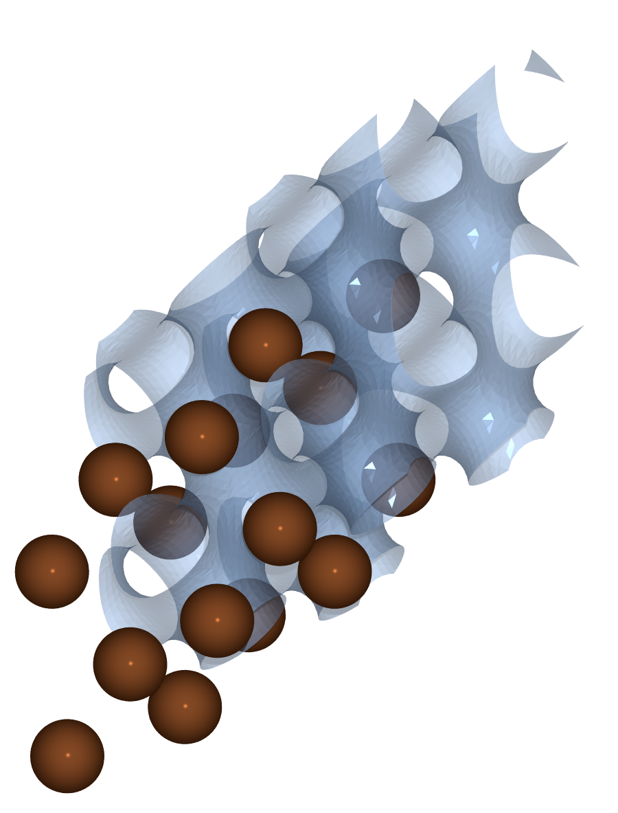
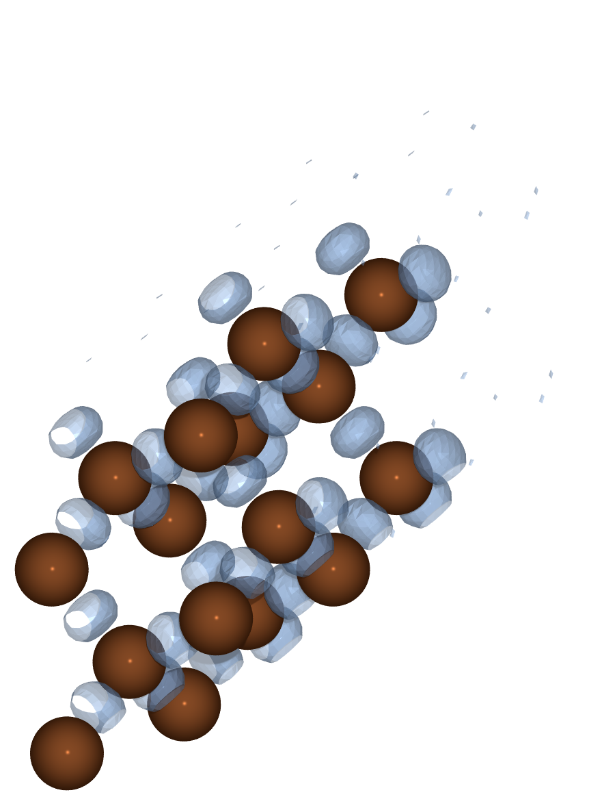
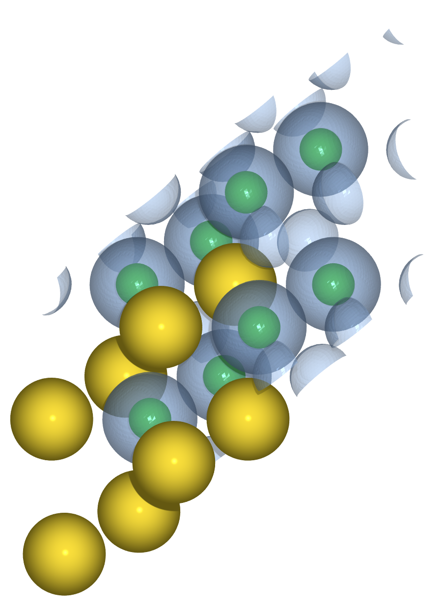
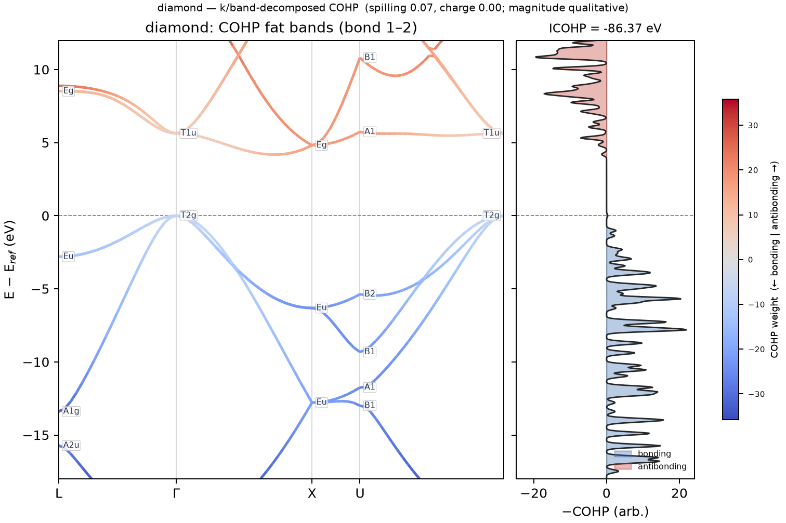
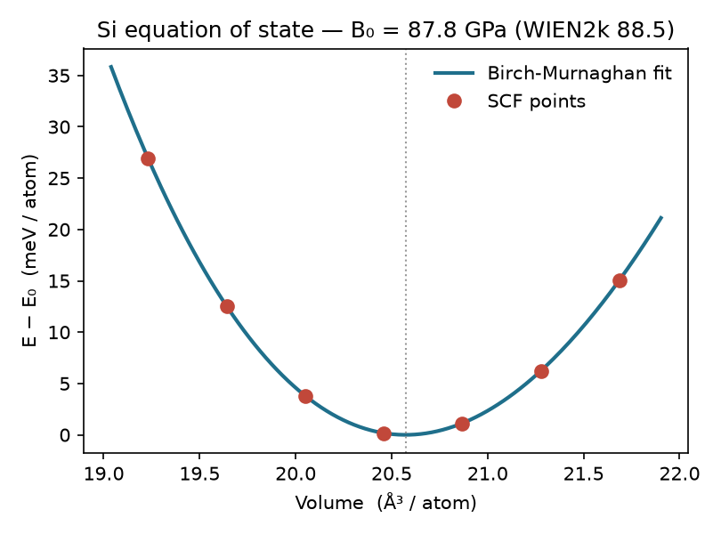

# Post-SCF analysis: densities, bonding, and the equation of state

A converged SCF holds the real-space density ρ(r) and the plane-wave
coefficients c_nk(G) in memory. The post-SCF modules read them back to produce
the quantities a plane-wave calculation is usually run for: the charge density
and its localization, the ionic charges, the bonding analysis, and the equation
of state. None of these needs a second SCF. This page walks through four of them
with shipped examples, and renders the volumetric fields with
[tinykit](https://github.com/wladerer/tinykit), a POV-Ray front end that reads
the VASP CHGCAR files gradwave writes.

## Volumetric export and rendering

`gradwave.postscf.volumetric` turns a result into the standard viewer formats.
`density(res)` returns ρ(r) in e/ų, `band_density(res, band, kpoint)` the
single-state density |ψ_nk(r)|² (the PARCHG analog), and `elf(res)` the
Becke-Edgecombe electron localization function[[38]](bibliography.md#elf),
ELF(r) ∈ [0,1], which reads 1 where an electron pair is localized and ≈½ in the
homogeneous-gas limit. The writers emit `.cube`, `.xsf`, or a VASP CHGCAR:

```python
from gradwave.postscf import volumetric as V

V.write_density(res, "diamond_CHGCAR")          # ρ(r), CHGCAR (VASP convention ρ·Ω)
V.write_elf(res, "diamond_ELF_CHGCAR")          # ELF(r) as a CHGCAR
```

The CHGCAR writer stores ρ·Ω, so ASE's `VaspChargeDensity` reader, and any tool
built on it, recovers ρ(r) in e/ų. From the YAML interface the same fields come
from an `output.volumetric` block with `format: chgcar` (see
[Inputs and outputs](io.md#volumetric-export)).

`examples/volumetric_density.py` runs an SCF on the 2-atom diamond cell, writes
the density and ELF, and renders a 2×2×2 supercell isosurface of each:

```bash
uv run python examples/volumetric_density.py --outdir examples
```

<figure markdown>
  { width="360" }
  { width="360" }
  <figcaption>Left: the valence charge density of diamond, isosurface at
  0.55 e/ų, traces the connected covalent network and the empty channels along
  the tetrahedral voids. Right: the ELF at 0.85 localizes on the bond midpoints,
  the signature of the covalent C-C pair. Both are 2×2×2 supercells rendered from
  a CHGCAR with <code>tk viz</code>.</figcaption>
</figure>

A supercell tiling reads more clearly than the primitive cell for a periodic
field, and a planar slice through the same grid is the other useful view. The
density integrates to the electron count, the single-state PARCHG integrates to
one, and the occupation-weighted sum of the PARCHG densities returns the total
density, all to machine precision (`tests/integration/test_volumetric.py`).

## Bader charges

The Bader (QTAIM) partition splits real space at the zero-flux surfaces of ρ(r):
each grid point is walked uphill along ∇ρ to a density maximum, and the volume
draining into each maximum is one atomic basin. Integrating ρ over a basin gives
the electrons assigned to that atom; the net charge is q_a = Z_a^val − N_a.
`gradwave.postscf.bader` implements the on-grid steepest-ascent scheme of
Henkelman, Arnaldsson, and Jónsson[[35]](bibliography.md#henkelman), vectorized as
grid-sized tensor operations.

One caveat sets the choice of example. gradwave's ρ is the valence
pseudo-density. In a homopolar covalent crystal such as Si the valence density
peaks in the bonds rather than on the nuclei, so the basins are bond-centered and
per-atom charges are not meaningful without the augmented PAW density. In an ionic
crystal the maxima sit on the ions, and the partition is clean. NaCl is the
textbook case:

```bash
uv run python examples/bader_nacl.py --outdir examples
```

```
  Bader charges (add_core=True):
    atom   Z_val   electrons   charge q [e]   volume [ų]
      Na     9.0       8.145        +0.855        9.86
      Cl     7.0       7.855        -0.855       34.99
    total electrons ∫ρ dr = 16.000; 9 attractors, 0 non-nuclear
```

Na comes out cationic and Cl anionic, at ±0.855 e, with no non-nuclear
attractors and the small-cation/large-anion volume split expected for rocksalt.
`add_core=True` folds the partial-core density back onto the grid to sharpen the
nuclear maxima; the core charge is not counted, so the reported charges stay
valence-referenced.

<figure markdown>
  { width="420" }
  <figcaption>Rocksalt NaCl valence density (2×2×2 supercell, isosurface
  0.18 e/ų): the charge concentrates on the Cl<sup>−</sup> anions, the Bader
  basins that carry the transferred electron.</figcaption>
</figure>

## Crystal orbital Hamilton populations (COHP)

COHP resolves the band energy into bonding and antibonding contributions per
atom pair. It is the Hamiltonian matrix element H_ij weighted by the density
matrix, projected onto a local orbital basis (Dronskowski and
Blöchl[[36]](bibliography.md#cohp); the plane-wave projection follows
LOBSTER[[37]](bibliography.md#lobster)). The sign convention is that negative COHP
is bonding and positive is antibonding, and the energy integral to the Fermi
level (ICOHP) measures the bond strength.

`gradwave.postscf.cohp` computes both the energy-resolved curve and the
k/band-resolved fat bands, so each eigenstate along a band path can be colored by
its Hamilton population on a chosen bond. `examples/cohp_fatbands.py` produces the
LOBSTER-style two-panel figure for diamond and GaAs:

```bash
uv run python examples/cohp_fatbands.py --outdir examples --only diamond
```

<figure markdown>
  { width="720" }
  <figcaption>Diamond C-C bond. Left: the band structure along L-Γ-X-U-Γ, each
  (k, band) colored by its COHP weight on the nearest-neighbor bond (bonding
  blue, antibonding red), with point-group irrep labels at the special points.
  Right: the energy-resolved −COHP(E) on the SCF mesh. The occupied valence bands
  are bonding, the conduction bands antibonding, the textbook picture of the
  covalent bond.</figcaption>
</figure>

The sign and the bonding/antibonding shape are correct. The absolute per-bond
ICOHP in a solid is not yet calibrated to LOBSTER (the pseudo-atomic basis
overshoots, the band-limited eigenvalue route undershoots), so read the magnitude
as qualitative and the sign and shape as quantitative.

## Equation of state and the Delta gauge

An isotropic volume scan and a fit to the third-order Birch-Murnaghan equation of
state[[39]](bibliography.md#birch) give the equilibrium volume V₀, the bulk
modulus B₀, and its pressure derivative B₀'. `run_eos` runs the scan, warm-starts
each SCF from the previous volume, and pins every volume to one shared FFT grid so
the energy differences are clean. `gradwave.postscf.eos` does the fit and the
Delta gauge. `examples/eos_silicon.py` runs it for Si:

```bash
uv run python examples/eos_silicon.py --outdir examples
```

<figure markdown>
  { width="480" }
  <figcaption>Si equation of state: seven SCF points and the Birch-Murnaghan fit.
  gradwave (PBE) gives V₀ = 20.57 ų/atom, B₀ = 87.8 GPa, B₀' = 4.21, against the
  WIEN2k all-electron reference V₀ = 20.45 ų/atom, B₀ = 88.5 GPa.</figcaption>
</figure>

The Delta gauge of Lejaeghere et al.[[40]](bibliography.md#delta) is the RMS
energy difference between two E(V) curves over a ±6% window, the standard measure
of how far a method sits from an all-electron reference. For this Si setup the
Delta against WIEN2k is 2.3 meV/atom; all-electron codes agree with each other to
about 1 meV, and a good pseudopotential lands within a few. Only the third-order
Birch-Murnaghan form is fit. The module also exposes `delta_value` for comparing
any two fits.
