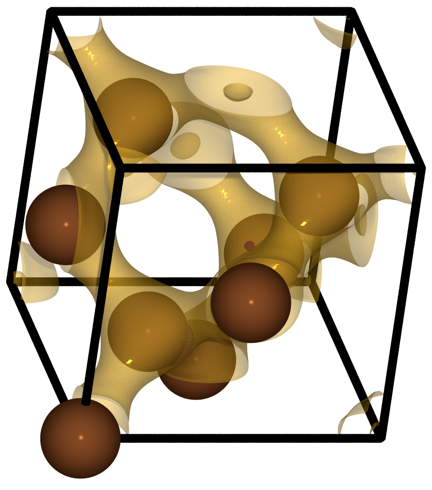
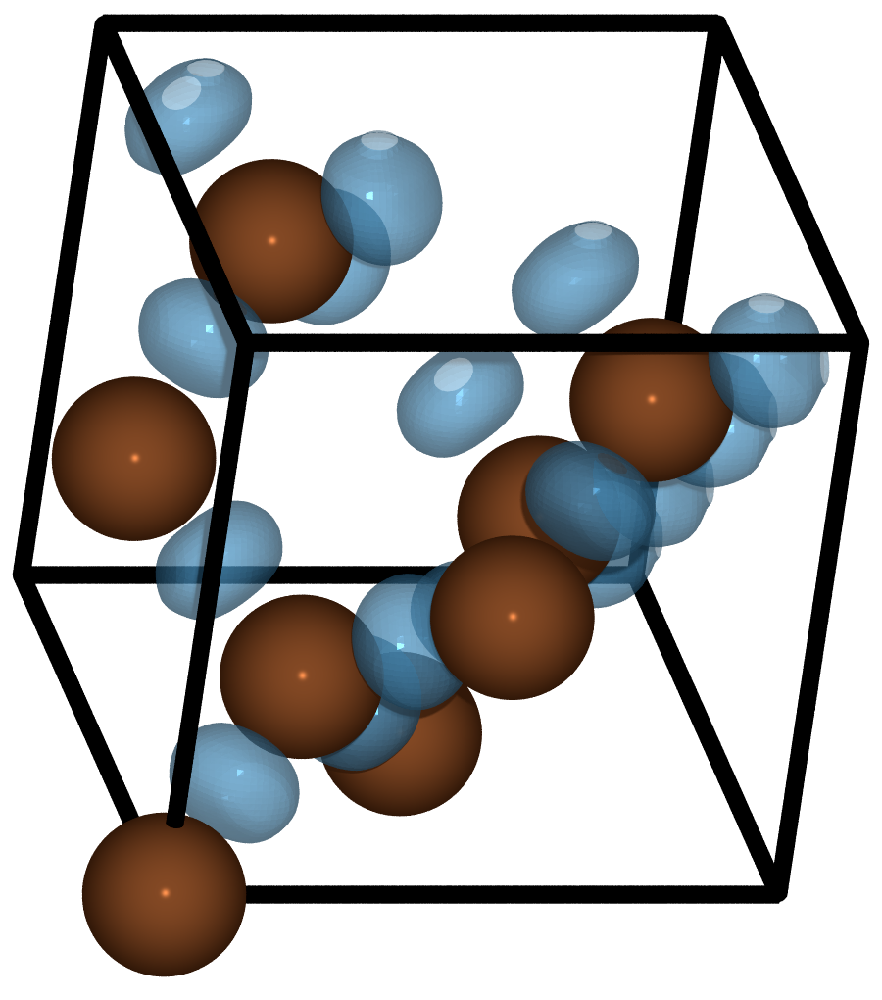
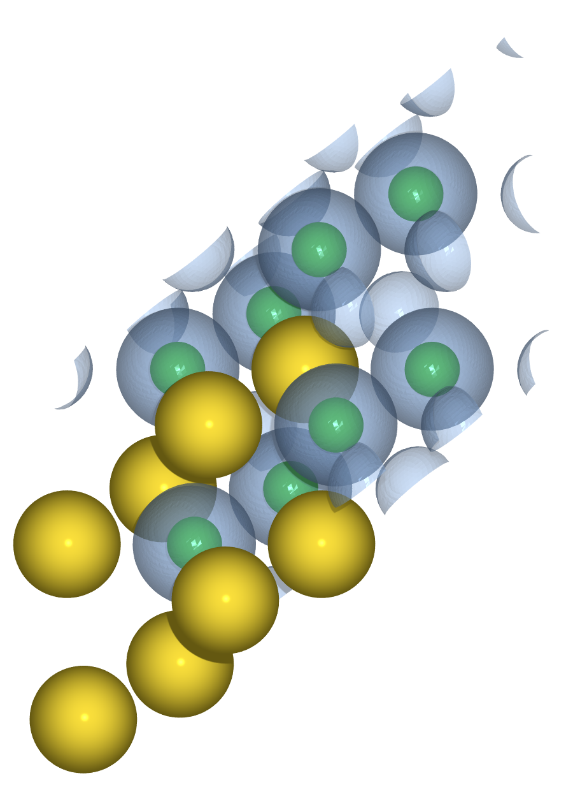
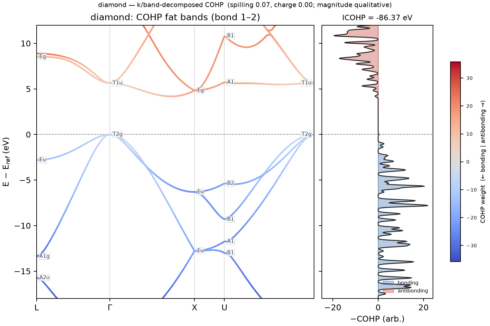
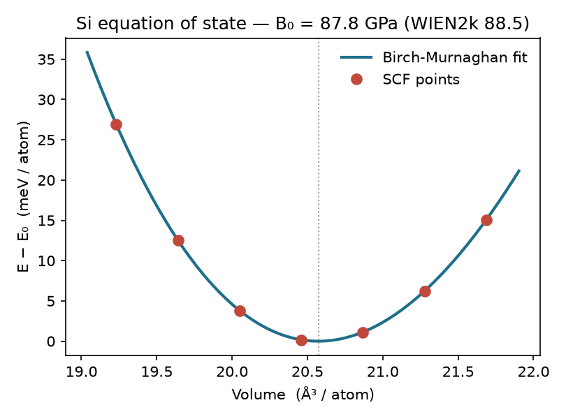

# Post-SCF properties and analysis

A converged SCF holds the real-space density ρ(r) and the plane-wave
coefficients c_nk(G) in memory. The post-SCF modules read them back to produce
the quantities a plane-wave calculation is usually run for. The first group
reads straight off one converged density, the charge density and its
localization, the ionic charges, and the bonding analysis. The second group
re-converges the SCF under a perturbation for the mechanical and response
properties, the equation of state, the Grimme dispersion correction, the phonon
dispersion and its harmonic thermodynamics, the elastic constants and the
directional Poisson response, and the dielectric tensor with the Born charges. This page walks through them with shipped examples, and renders the
volumetric fields with [tinykit](https://github.com/wladerer/tinykit), a POV-Ray
front end that reads the VASP CHGCAR files gradwave writes.

## Volumetric export and rendering

`gradwave.postscf.volumetric` turns a result into the standard viewer formats.
`density(res)` returns ρ(r) in e/ų, `band_density(res, band, kpoint)` the
single-state density |ψ_nk(r)|² (the PARCHG analog), and `elf(res)` the
Becke-Edgecombe electron localization function[[38]](bibliography.md#elf),
ELF(r) ∈ [0,1], which reads 1 where an electron pair is localized and ≈½ in the
homogeneous-gas limit. The writers emit `.cube`, `.xsf`, or a VASP CHGCAR:

```python
from gradwave.postscf import volumetric as V

V.write_density(res, "diamond_CHGCAR")          # ρ(r), CHGCAR (VASP convention ρ·Ω)
V.write_elf(res, "diamond_ELF_CHGCAR")          # ELF(r) as a CHGCAR
```

The CHGCAR writer stores ρ·Ω, so ASE's `VaspChargeDensity` reader, and any tool
built on it, recovers ρ(r) in e/ų. From the YAML interface the same fields come
from an `output.volumetric` block with `format: chgcar` (see
[Inputs and outputs](io.md#volumetric-export)).

`examples/volumetric_density.py` runs an SCF on the 2-atom diamond cell, writes
the density and ELF, and renders a 2×2×2 supercell isosurface of each:

```bash
uv run python examples/volumetric_density.py --outdir examples
```

<figure markdown>
  { width="360" }
  { width="360" }
  <figcaption>Left: the valence charge density of diamond, isosurface at
  0.55 e/ų, traces the connected covalent network and the empty channels along
  the tetrahedral voids. Right: the ELF at 0.85 localizes on the bond midpoints,
  the signature of the covalent C-C pair. Both are 2×2×2 supercells rendered from
  a CHGCAR with <code>tk viz</code>.</figcaption>
</figure>

A supercell tiling reads more clearly than the primitive cell for a periodic
field, and a planar slice through the same grid is the other useful view. The
density integrates to the electron count, the single-state PARCHG integrates to
one, and the occupation-weighted sum of the PARCHG densities returns the total
density, all to machine precision (`tests/integration/test_volumetric.py`).

## Bader charges

The Bader (QTAIM) partition splits real space at the zero-flux surfaces of ρ(r):
each grid point is walked uphill along ∇ρ to a density maximum, and the volume
draining into each maximum is one atomic basin. Integrating ρ over a basin gives
the electrons assigned to that atom; the net charge is q_a = Z_a^val − N_a.
`gradwave.postscf.bader` implements the on-grid steepest-ascent scheme of
Henkelman, Arnaldsson, and Jónsson[[35]](bibliography.md#henkelman), vectorized as
grid-sized tensor operations.

One caveat sets the choice of example. gradwave's ρ is the valence
pseudo-density. In a homopolar covalent crystal such as Si the valence density
peaks in the bonds rather than on the nuclei, so the basins are bond-centered and
per-atom charges are not meaningful without the augmented PAW density. In an ionic
crystal the maxima sit on the ions, and the partition is clean. NaCl is the
textbook case:

```bash
uv run python examples/bader_nacl.py --outdir examples
```

```
  Bader charges (add_core=True):
    atom   Z_val   electrons   charge q [e]   volume [ų]
      Na     9.0       8.145        +0.855        9.86
      Cl     7.0       7.855        -0.855       34.99
    total electrons ∫ρ dr = 16.000; 9 attractors, 0 non-nuclear
```

Na comes out cationic and Cl anionic, at ±0.855 e, with no non-nuclear
attractors and the small-cation/large-anion volume split expected for rocksalt.
`add_core=True` folds the partial-core density back onto the grid to sharpen the
nuclear maxima; the core charge is not counted, so the reported charges stay
valence-referenced.

<figure markdown>
  { width="420" }
  <figcaption>Rocksalt NaCl valence density (2×2×2 supercell, isosurface
  0.18 e/ų): the charge concentrates on the Cl<sup>−</sup> anions, the Bader
  basins that carry the transferred electron.</figcaption>
</figure>

## Crystal orbital Hamilton populations (COHP)

COHP resolves the band energy into bonding and antibonding contributions per
atom pair. It is the Hamiltonian matrix element H_ij weighted by the density
matrix, projected onto a local orbital basis (Dronskowski and
Blöchl[[36]](bibliography.md#cohp); the plane-wave projection follows
LOBSTER[[37]](bibliography.md#lobster)). The sign convention is that negative COHP
is bonding and positive is antibonding, and the energy integral to the Fermi
level (ICOHP) measures the bond strength.

`gradwave.postscf.cohp` computes both the energy-resolved curve and the
k/band-resolved fat bands, so each eigenstate along a band path can be colored by
its Hamilton population on a chosen bond. `examples/cohp_fatbands.py` produces the
LOBSTER-style two-panel figure for diamond and GaAs:

```bash
uv run python examples/cohp_fatbands.py --outdir examples --only diamond
```

<figure markdown>
  { width="720" }
  <figcaption>Diamond C-C bond. Left: the band structure along L-Γ-X-U-Γ, each
  (k, band) colored by its COHP weight on the nearest-neighbor bond (bonding
  blue, antibonding red), with point-group irrep labels at the special points.
  Right: the energy-resolved −COHP(E) on the SCF mesh. The occupied valence bands
  are bonding, the conduction bands antibonding, the textbook picture of the
  covalent bond.</figcaption>
</figure>

The sign and the bonding/antibonding shape are correct. The absolute per-bond
ICOHP in a solid is not yet calibrated to LOBSTER (the pseudo-atomic basis
overshoots, the band-limited eigenvalue route undershoots), so read the magnitude
as qualitative and the sign and shape as quantitative.

## Equation of state and the Delta gauge

An isotropic volume scan and a fit to the third-order Birch-Murnaghan equation of
state[[39]](bibliography.md#birch) give the equilibrium volume V₀, the bulk
modulus B₀, and its pressure derivative B₀'. `run_eos` runs the scan, warm-starts
each SCF from the previous volume, and pins every volume to one shared FFT grid so
the energy differences are clean. `gradwave.postscf.eos` does the fit and the
Delta gauge. `examples/eos_silicon.py` runs it for Si:

```bash
uv run python examples/eos_silicon.py --outdir examples
```

<figure markdown>
  { width="480" }
  <figcaption>Si equation of state: seven SCF points and the Birch-Murnaghan fit.
  gradwave (PBE) gives V₀ = 20.57 ų/atom, B₀ = 87.8 GPa, B₀' = 4.21, against the
  WIEN2k all-electron reference V₀ = 20.45 ų/atom, B₀ = 88.5 GPa.</figcaption>
</figure>

The Delta gauge of Lejaeghere et al.[[40]](bibliography.md#delta) is the RMS
energy difference between two E(V) curves over a ±6% window, the standard measure
of how far a method sits from an all-electron reference. For this Si setup the
Delta against WIEN2k is 2.3 meV/atom; all-electron codes agree with each other to
about 1 meV, and a good pseudopotential lands within a few. Only the third-order
Birch-Murnaghan form is fit. The module also exposes `delta_value` for comparing
any two fits.

`analysis.eos_frame` returns the E(V) points and the fitted-curve energy per volume
as a DataFrame, with V₀, B₀, and B₀' on `df.attrs`. `analysis.plot_eos`, wrapped by
`gradwave plot eos.json`, draws the points, the Birch-Murnaghan curve through them,
and the equilibrium volume.

## Grimme dispersion (D3 and D4)

A semilocal functional misses the long-range correlation that binds layered and
molecular solids. gradwave adds it back as an opt-in Grimme correction, D3(BJ)
by default and the charge-dependent D4(BJ) on request. Both are geometric
pairwise sums over ordered atom pairs and lattice images, so the energy, the
forces, and the stress come from one autograd pass through the same position-
and cell-differentiable expression the Ewald sum uses.

The D3(BJ) energy sums $s_6 C_6/(r^6 + f^6) + s_8 C_8/(r^8 + f^8)$ over the
pairs, with $C_6^{AB}$ interpolated from coordination-number-resolved reference
tables by a Gaussian weighting in the fractional coordination numbers and the
Becke-Johnson radius $f_{AB}$ damping the short-range divergence. D4(BJ)
reweights the reference polarizabilities by a classical
electronegativity-equilibration (EEQ) partial charge, so the $C_6$ responds to
the local charge state. The periodic EEQ solve carries the bare-Coulomb $1/r$
tail, and gradwave splits it with the same Ewald parameter the electrostatic
sum uses (`postscf.dispersion`, `postscf.dispersion_d4`).

The correction is a `dispersion` block on any task, added to the reported total
energy, forces, and stress. `method` selects the model.

```yaml
dispersion:
  method: d4          # d3 (default) | d4
  charge: 0.0         # D4 EEQ total cell charge (ignored for D3)
```

The shorthand `dispersion: true` turns on D3(BJ) with the functional-resolved
default parameters. The ASE calculator takes the same switch through its
`dispersion=` argument.

Validation: the D3(BJ) energy matches an independent loop-based transcription of
the reference dftd3 expression to $10^{-10}$ relative, and the periodic and
molecular sums both agree. D4(BJ) matches the tad-dftd4 0.8.0 two-body reference
energies across a rattled multi-element set and passes an autograd gradcheck
through the whole EEQ → ζ → C6 → BJ chain.

## Supercell phonons

Density-functional perturbation theory builds the dynamical matrix from a
linear-response solve at each q. Instead, gradwave takes the frozen-phonon
route. It builds an $N\times N\times N$ supercell, displaces atoms, and collects
the real-space force constants $\Phi_{\mu\nu}(R) = \partial^2 E / \partial
\tau_{0\mu}\partial\tau_{R\nu}$ from the ground-state forces. Because the force
constants have the periodicity of the primitive lattice, only the primitive
home-cell atoms are displaced, so the SCF count is $6 N_\text{prim}$ and
independent of supercell size (Si $2\times2\times2$ costs 12 SCFs, not 96).

Fourier interpolation of the force constants gives the dynamical matrix at any q,
so one set of supercell forces yields the full dispersion along a q-path and the
phonon density of states (`postscf.phonons_supercell`). The analytic Γ-point
response (`postscf.phonons`) stays available for the zone center. The supercell
route runs for any q on the norm-conserving and USPP/PAW paths alike (the force
routine is chosen per formalism, so the same input drives both).

```yaml
task: phonons
phonons:
  supercell: [2, 2, 2]      # diagonal supercell for the force constants
  displacement: 0.01        # atomic displacement h [Å] for the central FD
  path: ""                  # ASE bandpath string; "" = default
  dos_mesh: [8, 8, 8]       # MP q-mesh for the DOS
```

Start from a relaxed cell, since residual stress or forces shift the
frequencies. Validation: the Si $2\times2\times2$ dispersion gives a Γ optical
phonon near 521 cm⁻¹ against the ~520 experiment, three acoustic branches at
zero, and no imaginary branch along the path.

## Thermodynamics from the phonon DOS

The vibrational free energy, entropy, and heat capacity of a harmonic crystal
follow from its phonon density of states. Typically these come from a separate
thermodynamics pass over a stored frequency file. Instead, gradwave integrates
the phonon DOS it already produced, so the same supercell force constants that
gave the dispersion also give the temperature-dependent thermodynamics
(`postscf.thermo`).

The heat capacity is $C_V(T) = k_B \int g(\omega)\, x^2 e^x/(e^x-1)^2\,
d\omega$ with $x = \hbar\omega/k_B T$, and the entropy, internal energy, and
Helmholtz free energy come from the same Bose integral. The zero-point energy is
$\tfrac{1}{2}\int \hbar\omega\, g(\omega)\, d\omega$, and a Debye temperature is
estimated from the second moment of the DOS. `heat_capacity_in_kB` reports $C_V$
in units of $k_B$, so the Dulong-Petit plateau reads directly as
$3N_\text{atoms}$.

For a metal the electronic states near the Fermi level add a linear term.
`electronic_heat_capacity` gives the Sommerfeld $C_V^\text{el} =
\tfrac{\pi^2}{3} k_B^2 T\, g(E_F)$ from the electronic DOS at $E_F$. This term
dominates the total as $T\to0$, where the phonon contribution vanishes as $T^3$.

The integrals satisfy the harmonic limits by construction. $C_V$ rises to the
$3N_\text{atoms}\,k_B$ Dulong-Petit plateau at high temperature and falls to zero
as $T\to0$, the zero-point energy is positive, and the free energy stays
consistent with $F = U - TS$.

## Elastic constants

The elastic tensor $C_{ij} = \partial\sigma_i/\partial\varepsilon_j$ (Voigt
$6\times6$) is obtained by straining the cell along each of the six symmetric
Voigt directions by $\pm h$, re-converging the SCF, and central-differencing
gradwave's analytic stress (`postscf.stress` norm-conserving,
`postscf.paw_stress` USPP/PAW). Each strained SCF is warm-started from the
reference density and pinned to one FFT grid, so the 13 solves (a reference plus
six strains at two signs) share a clean stress baseline. The Voigt-Reuss-Hill
averages give the polycrystalline bulk and shear moduli.

By default the tensor is the clamped-ion one. The cell is strained with
fractional coordinates held fixed and only the electrons re-relax. This is
exact for any constant with no symmetry-allowed internal displacement, the bulk
modulus of any crystal and every constant of rocksalt, but the diamond and
zincblende shear constants pick up an internal sublattice shift the clamped
tensor omits (PBE Si clamped-ion $C_{44} \approx 98$ GPa against the relaxed
$\approx 76$). $C_{11}$, $C_{12}$, and the bulk modulus are unaffected, and the
elastic-tensor bulk modulus matches the equation-of-state value from the same
PBE setup.

`elastic.mode: relaxed` computes the relaxed-ion tensor instead. Every strained
cell gets a fixed-cell BFGS relaxation of the internal coordinates on the
analytic forces, gated by `elastic.fmax`, before the stress is read, so the
central difference runs along the relaxed path. This is the tensor that
compares to experiment whenever the compliance is dominated by internal
degrees of freedom. Quartz is the extreme case, where rigid SiO$_4$ tetrahedra
rotate under strain and the clamped-ion constants overshoot the relaxed ones
several-fold. The cost is one ionic relaxation instead of one SCF per strained
cell, with each ionic step warm-started from the previous one. Strains that
allow no internal displacement converge in zero steps and cost the same as the
clamped run. The input geometry is assumed to be the equilibrium one, and the
residual reference `fmax` is reported in the output so a non-equilibrium start
is visible.

```yaml
task: elastic
elastic:
  strain: 0.005             # Voigt strain magnitude for the central difference
  mode: relaxed             # clamped (default) | relaxed (per-strain ionic relax)
  fmax: 0.01                # relaxed mode: per-strain force gate [eV/Å]
  max_steps: 100            # relaxed mode: per-strain BFGS step cap
```

The Voigt-Reuss-Hill Poisson ratio is the isotropic polycrystalline average,
which is positive for nearly every material. A single crystal can still be
auxetic along particular directions, and that response comes from the full
compliance tensor $S = C^{-1}$. `directional_poisson` gives the ratio
$\nu(\mathbf{n}, \mathbf{m})$ for a uniaxial load along $\mathbf{n}$ with the
transverse strain read along $\mathbf{m}\perp\mathbf{n}$, and
`min_directional_poisson` scans a Fibonacci grid of loading directions to return
the minimum $\nu$ and the axes that reach it. A negative minimum is the auxetic
signature. For cubic Cu the scan returns $\nu_\text{min} \approx -0.13$ along
$\langle110\rangle$ while the Hill average stays near $+0.35$, the known result
that most cubic metals are auxetic along $\langle110\rangle$ even though their
polycrystalline average is not. `is_mechanically_stable` checks the Born
stability criteria on $C$ before either average is trusted.

`analysis.elastic_frame` returns the $6\times6$ stiffness $C$ [GPa] as a DataFrame
with the Voigt-Reuss-Hill moduli, Young's modulus, Poisson ratio, and the stability
flag on `df.attrs`. `analysis.plot_elastic`, wrapped by `gradwave plot elastic.json`,
renders $C$ as an annotated heatmap with the bulk and shear moduli in the title.

## Dielectric tensor and Born effective charges

The macroscopic dielectric tensor $\varepsilon_\infty$ and the Born effective
charges usually come from a hand-coded electric-field DFPT calculus. Instead,
gradwave assembles them from autograd. The position operator on Bloch states
comes from a Sternheimer solve with $\partial H/\partial k$ on the right-hand
side, the self-consistent screening runs through the Hartree-XC kernel as an
autograd Hessian-vector product of $E_\text{Hxc}$ so no $f_\text{xc}$ is written
by hand, and the Born charges are the mixed position-field derivative from one
backward pass through the position-differentiable pseudopotential
(`postscf.dielectric`).

The response runs for insulators with scalar-relativistic pseudopotentials and
`use_symmetry=False`, where the time-reversal fold stays valid because the
response quantities fold evenly. Collinear spin is threaded per channel. The
Sternheimer solve runs independently for each spin, the screening field couples
the two channels through the spin Hxc kernel, and the nonmagnetic limit
reproduces the nspin=1 tensor to $2\times10^{-4}$.

## Core-correction (NLCC) forces

A pseudopotential with a nonlinear core correction carries a partial core charge
that enters the exchange-correlation energy. gradwave includes its contribution
to the atomic forces. The core density rides its atom's structure factor, so its
position dependence enters the one autograd pass the Hellmann-Feynman forces
already use (`postscf.forces`). The term is validated against a finite difference
of the total energy to below $10^{-6}$ eV/Å on a low-symmetry carbon cell, for
both GGA and meta-GGA functionals, where the meta-GGA $v_\text{xc}$ additionally
sees the kinetic-energy density.
