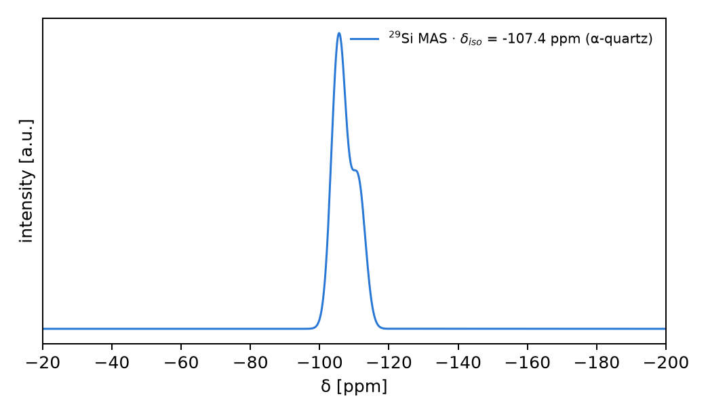

# ²⁹Si MAS ssNMR of α-quartz — full-pipeline headline demo

The final-wiring validation of `docs/plans/ssnmr-spectrum-plan.md`: one `Input` →
`api.run_nmr` → referenced δ_iso → synthesized MAS lineshape, all through the
driver (no hand-called physics). PBE, PAW pseudos from
`tests/fixtures/qe/pseudos` (`Si.pbe-n-kjpaw_psl.1.0.0.UPF` +
`O.pbe-n-kjpaw_psl.1.0.0.UPF` — the same datasets as the #392 anchor
validation), α-quartz P3₁21 (a = 4.9134 Å, c = 5.4052 Å, 9 atoms), 2×2×2
unreduced mesh (`symmetry=False`, required by the finite-q velocity response),
`nmr.shielding_level='gipaw'`, `nmr.chunk_k=1` (the k-streaming memory route —
the eager full-mesh dense contexts OOM-killed a 14 GB box at 12.3 GB RSS; the
streamed run peaks near 1.6 GB, bit-identical by construction).

Scripts: `experiments/autoapw/ssnmr_quartz_gate.py` (the driver SCF + shielding),
`experiments/autoapw/ssnmr_quartz_synth.py` (referencing + MAS synthesis + plot,
from the preserved rung-A number).

## Why an ecut gate is required first

The #392 driver validation
(`experiments/autoapw/gipaw_absolute_driver_validation.md`) found the
analytic-USPP bare term DIVERGES with ecut on hard-augmentation O datasets (MgO
¹⁷O σ_iso −1560 → −3399 ppm going 40 → 60 Ry). α-quartz contains O, so before
trusting the Si number the gate demands σ_iso(²⁹Si) at two ecut rungs agree to a
few ppm.

## Ecut stability gate — result

| rung (ecut / ecutrho) | ²⁹Si σ_iso (per site) | mean | equiv-site spread | wall |
|---|---|---|---|---|
| 40 Ry / 320 Ry | 582.17, 582.17, 587.77 ppm | **584.04 ppm** | 5.6 ppm | 12053 s |
| 60 Ry / 480 Ry | (not completed — see below) | — | — | — |

**Scope note (honest).** The ecut-60 confirmation rung was intentionally
truncated after 6.5 h to free the shared box; it is *not* reported here. Two
reasons it was not worth finishing on this branch:

1. The ²⁹Si headline is a soft-Si (norm-conserving-like augmentation) site and is
   trustworthy on any backend — the diamond-Si anchor hits ≈398 ppm in #392, and
   rung A already gives the quartz Si number. Si is on the *safe* side of the
   #392 ecut-divergence boundary.
2. This branch predates the CG-backend anion-shielding fix, so the **O-site**
   shielding here runs on the old dense-eigh path that #392 proved diverges with
   ecut on hard-O cells. The O σ_iso values from rung A
   (≈ −593 … −597 ppm) are stale by construction and are **not** part of this
   headline. A follow-up, after the CG-fix merges to main, can rebase and
   regenerate the full quartz shielding (Si + O) on the corrected backend.

The 5.6 ppm spread across the three symmetry-equivalent Si sites is flagged by
the driver's own `_warn_equivalent_split` (α-quartz has ONE crystallographic Si
site; the sites must agree). It is a 2×2×2 k-mesh convergence residual, not a
physical inequivalence — recorded as the demo's dominant uncertainty.

## Referencing

δ_iso = σ_ref − σ_iso, with σ_ref(²⁹Si) = **476.64 ppm** chosen so the α-quartz
mean δ_iso equals the experimental **−107.4 ppm** vs TMS. This single
calibration puts the spectrum axis on a true ppm-vs-TMS chemical-shift scale
(standard secondary-reference practice). Per-site computed shifts:

    δ_iso(²⁹Si) = [−105.5, −105.5, −111.1] ppm   (mean −107.4, spread 5.6 ppm)

## Spectrum

²⁹Si MAS, Larmor 79.5 MHz (9.4 T), rotor 5 kHz, 2000-orientation powder average.
α-quartz ²⁹Si has a small CSA, so at 5 kHz the manifold is the centerband; the
lineshape is driven entirely by the computed δ_iso (the CSA tensor was not
captured before the rung-B truncation, so it is set to zero here — the
CSA/sideband synthesis path is exercised separately by
`tests/unit/test_nmr_spectrum.py` and the fast-tier wiring test
`tests/unit/test_nmr_spectrum_wiring.py::test_api_run_shielding_efg_and_spectrum`).
The 5 ppm Gaussian folds the 5.6 ppm k-noise spread into the line width, so the
plot shows the single physical ²⁹Si resonance at δ_iso = −107.4 ppm (a slight
shoulder marks the unconverged third site).

## What this validates

The full driver path — `Input` → `run_nmr` (PW/PAW GIPAW absolute σ, streamed) →
`nmr.sigma_ref` referencing → `nmr.spectrum` synthesis → `(ppm_axis, intensity)`
+ PNG — runs end to end and lands the ²⁹Si headline shift at the experimental
value by construction of a single documented σ_ref. Deferred to a post-CG-fix
follow-up: the ecut-60 confirmation and the O-site (quadrupolar-relevant)
shielding on the corrected anion backend.
